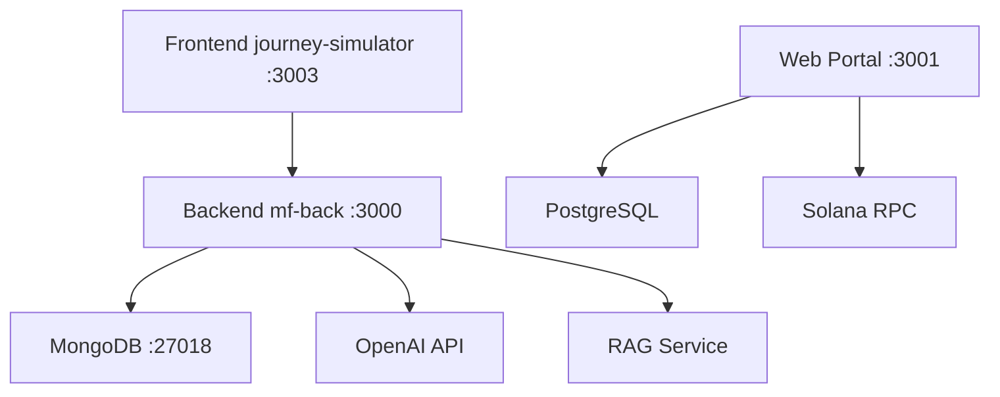

# System Map — MFAI Platform

## Services Overview

### 1. Frontend: journey-simulator
- **Tech Stack**: React 19 + TypeScript + Vite + Tailwind + Zustand
- **Port (dev)**: 3003
- **Port (preview)**: 3003
- **Base URL**: http://127.0.0.1:3003
- **Health Endpoint**: / (root)
- **Build Command**: npm run build
- **Preview Command**: npm run preview
- **Required Env Vars**:
  - VITE_API_BASE_URL (backend URL)
  - VITE_PORT (optional, default 3003)

### 2. Backend: mf-back
- **Tech Stack**: Express + MongoDB + OpenAI SDK
- **Port**: 3000 (default), proxied to 3002 in docker
- **Base URL**: http://127.0.0.1:3000
- **Health Endpoint**: /health (if exists), / (index)
- **Start Command**: npm start (production), npm run dev (development)
- **Required Env Vars**:
  - MONGO_URI (MongoDB connection string)
  - PORT (optional, default 3000)
  - JWT_SECRET (authentication)
  - OPENAI_API_KEY (LLM integration)
  - RAG_SEARCH_URL (RAG service)
  - RAG_INDEX_NAME (RAG index)

### 3. Database: MongoDB
- **Port**: 27018 (based on app.js default)
- **Connection**: mongodb://127.0.0.1:27018/journey
- **Collections**: Users, Journeys, AgentLogs, AgentRuns

### 4. Web Portal: web
- **Tech Stack**: Next.js (App Router) + Prisma + Postgres
- **Port**: 3001
- **Base URL**: http://127.0.0.1:3001
- **Database**: PostgreSQL (for Web3/NFT features)

## Service Dependencies

## API Integration Points

- Frontend → Backend: REST API (axios, apiBase configured via VITE_API_BASE_URL)
- Backend → MongoDB: Mongoose ODM
- Backend → OpenAI: OpenAI SDK (agent orchestration, RAG)
- Backend → RAG: HTTP client (ragClient.js)

## Execution Profiles

### PROFILE_A: Local Dev
- Frontend: vite dev server (HMR enabled, port 3003)
- Backend: nodemon (port 3000)
- Database: local MongoDB (port 27018)

### PROFILE_B: Prod-like Preview
- Frontend: vite build + vite preview (no HMR, port 3003)
- Backend: node ./bin/www (production mode, port 3000)
- Database: local MongoDB (port 27018)
- Clean storage: localStorage/sessionStorage cleared

### PROFILE_C: Chain Mode (Devnet/Testnet)
- Same as PROFILE_B
- Web3 enabled: wallet connect permitted
- No on-chain transactions in connect-only mode (enforced by scans)
