<!-- Production Ready - 2026 | Contributors: Alaeddine BEN RHOUMA, Kamel BEN RHOUMA, Adem BELHAJAISSA -->

<!-- Production Ready - 2026 | Contributors: Alaeddine BEN RHOUMA, Kamel BEN RHOUMA, Adem BELHAJAISSA -->

<!-- Production Ready - 2026 | Contributors: Alaeddine BEN RHOUMA, Kamel BEN RHOUMA, Adem BELHAJAISSA -->

# 🏗️ Diagrammes d'Architecture - Money Factory AI

*Collection complète de diagrammes Mermaid pour documenter l'architecture du projet*

---

## 📋 Table des Matières

1. [Architecture Monorepo](#architecture-monorepo)
2. [Flux de Données Principal](#flux-de-données-principal)
3. [Architecture Zyno Orchestrator](#architecture-zyno-orchestrator)
4. [Architecture UI - Trinity Layout](#architecture-ui---trinity-layout)
5. [State Management](#state-management)
6. [Flux API](#flux-api)
7. [Schéma de Base de Données](#schéma-de-base-de-données)
8. [Personas & Phases](#personas--phases)

---

## 1. Architecture Monorepo

### Vue d'Ensemble

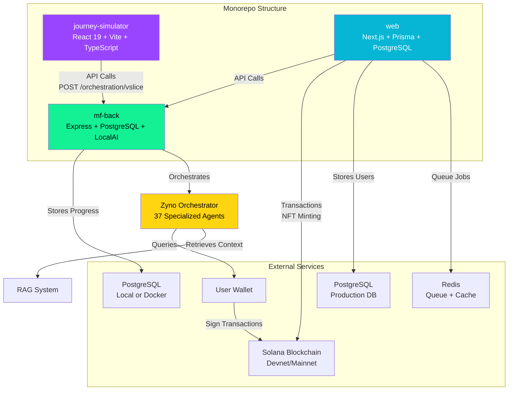

---

## 2. Flux de Données Principal

### Sequence Diagram - Journey Execution

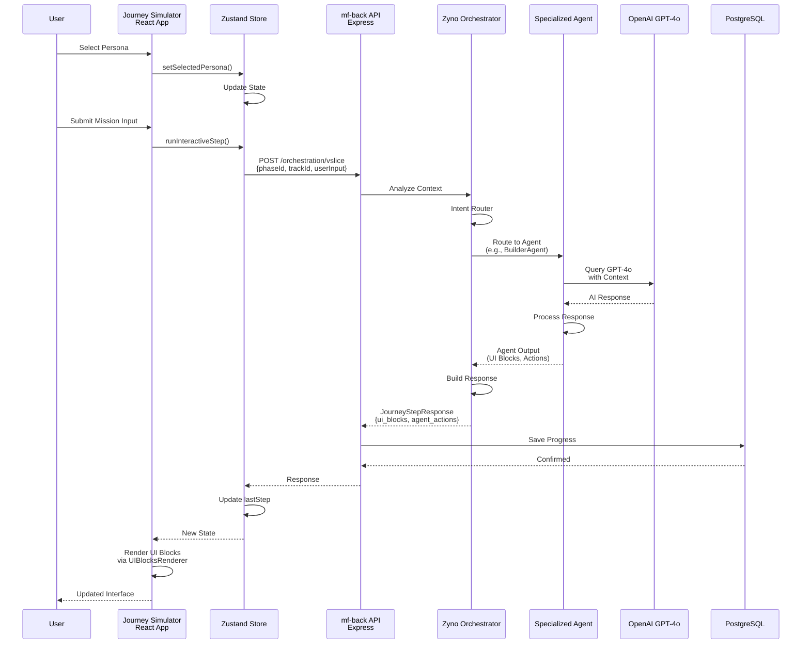

---

## 3. Architecture Zyno Orchestrator

### Vue Détaillée

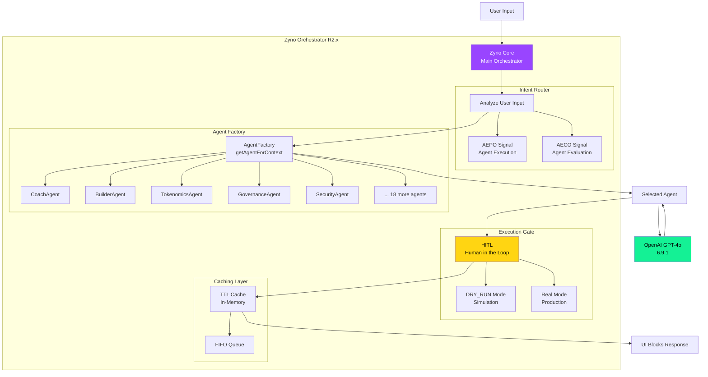

### Agent Routing Logic

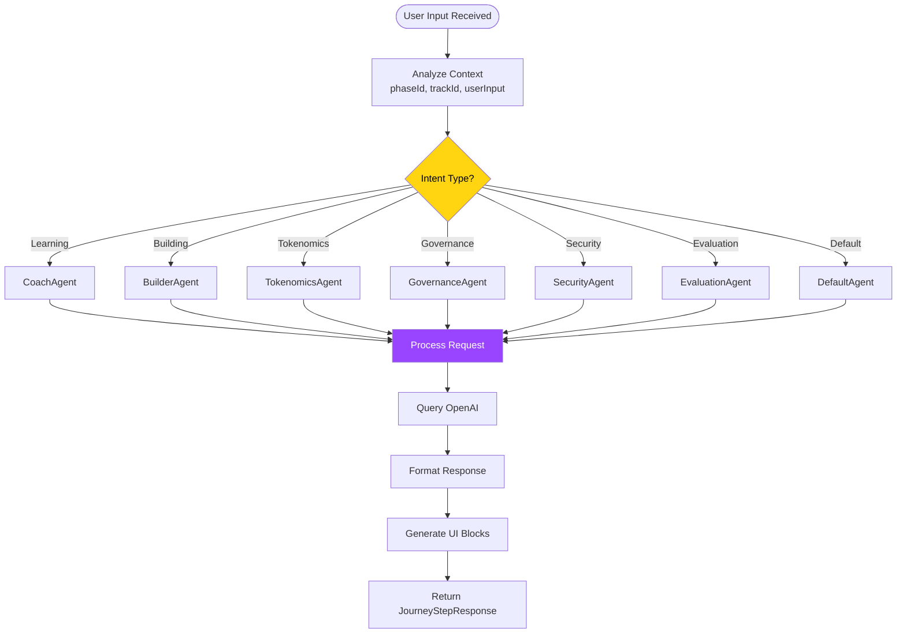

---

## 4. Architecture UI - Trinity Layout

### Layout Structure

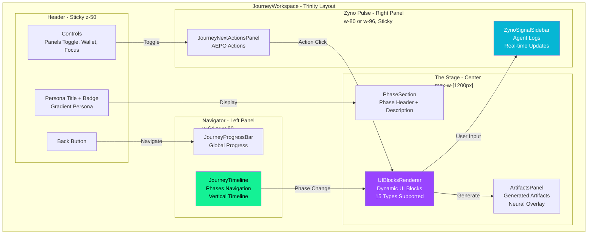

### Component Hierarchy

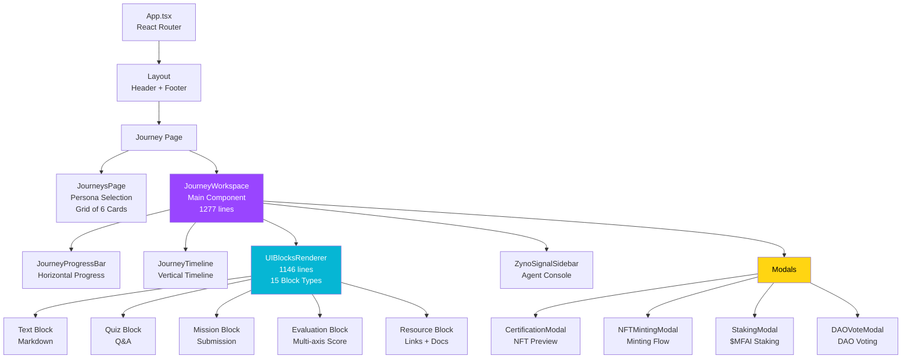

---

## 5. State Management

### Zustand Store Structure

```mermaid
graph LR
    subgraph "JourneyStore (Zustand)"
        State[State<br/>Immutable]
        Actions[Actions<br/>Methods]

        State --> SP[selectedPersona<br/>Persona | null]
        State --> CP[currentPhase<br/>number]
        State --> UP[userProgress<br/>UserProgress]
        State --> LS[lastStep<br/>JourneyStepResponse]
        State --> ISL[isStepLoading<br/>boolean]
        State --> APIJ[apiJourneyId<br/>string]

        Actions --> RIS[runInteractiveStep<br/>async function]
        Actions --> CPH[completePhase<br/>async function]
        Actions --> SPP[setSelectedPersona<br/>function]
        Actions --> UP2[updateProgress<br/>async function]
        Actions --> MINT[mintNFT<br/>async function]
    end

    Components[React Components] -->|useJourneyStore<br/>with shallow| State
    Components -->|Call| Actions
    Actions -->|Update| State
    State -->|Re-render| Components

    API[API Server] -->|Response| Actions
    Actions -->|Request| API

    LocalStorage[(localStorage)] -->|Persist| State
    State -->|Load| LocalStorage

    style State fill:#9945ff,color:#fff
    style Actions fill:#14f195,color:#000
    style LocalStorage fill:#ffd512,color:#000
```

### State Flow

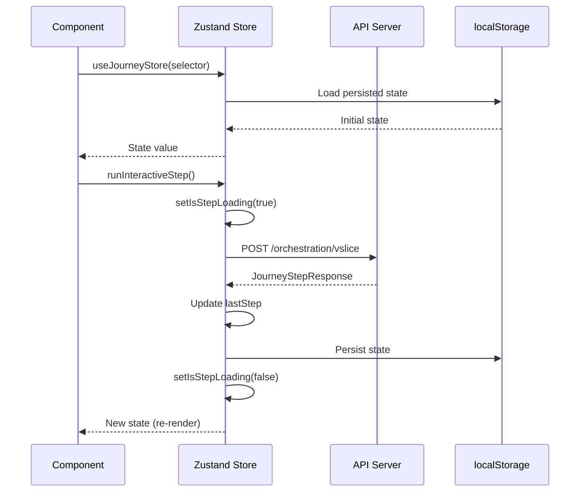

---

## 6. Flux API

### API Endpoints Flow

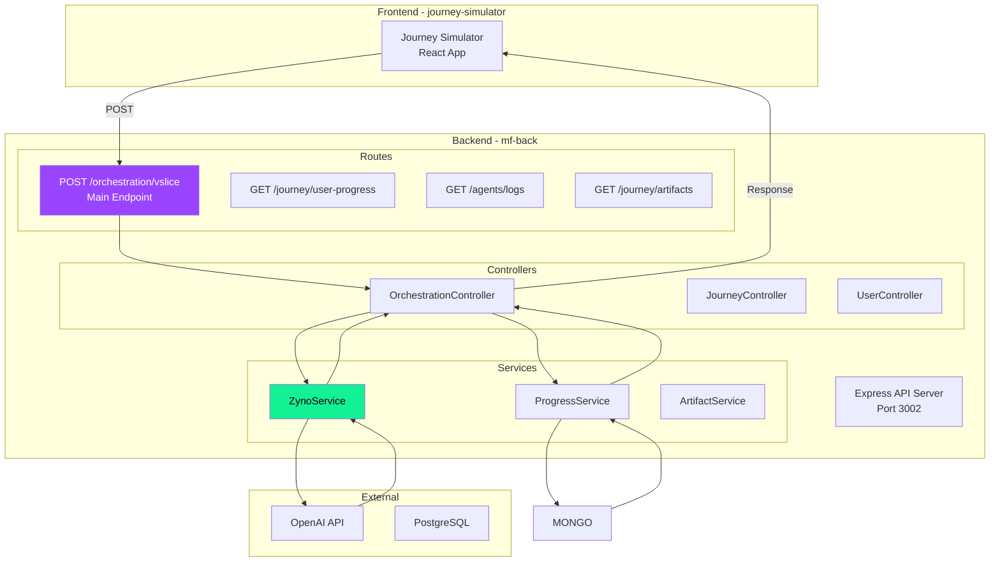

---

## 7. Schéma de Base de Données

### PostgreSQL Schema (mf-back)

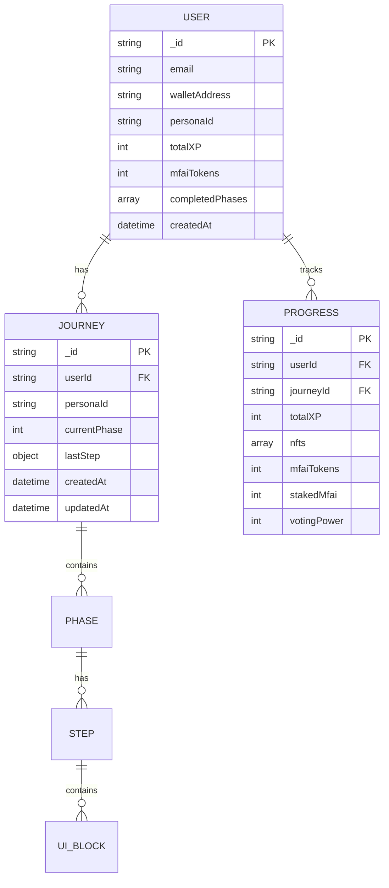

### PostgreSQL Schema (web)

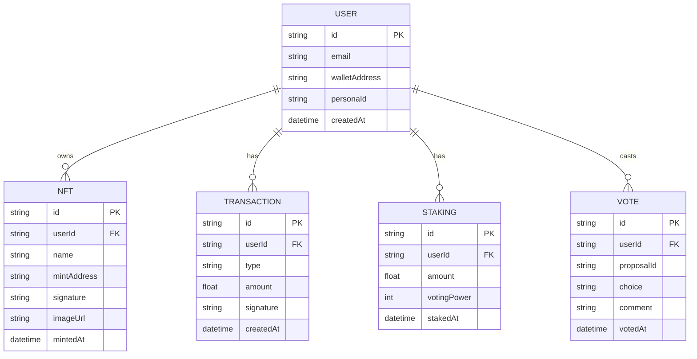

---

## 8. Personas & Phases

### Structure Complète

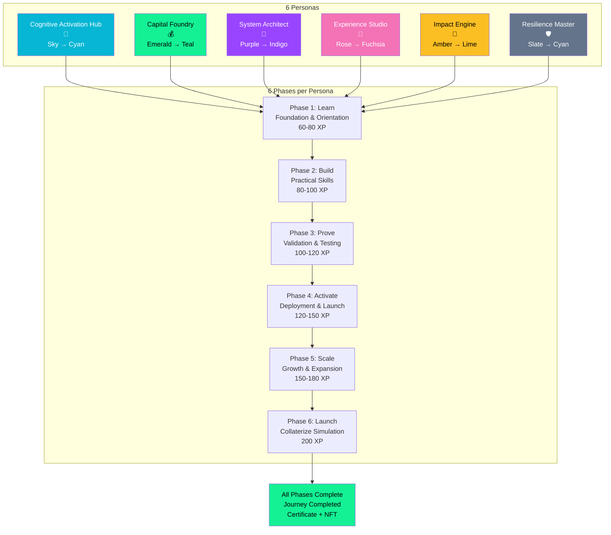

---

## 9. NFT Minting Flow

### Processus Complet

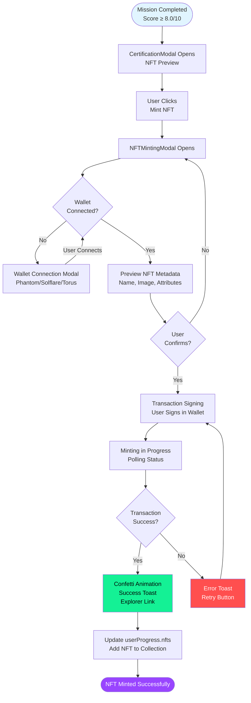

---

## 10. Web3 Integration Flow

### Solana Integration

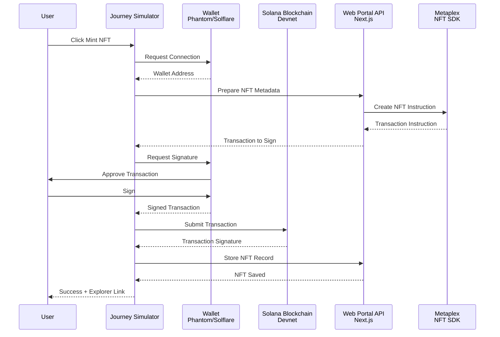

---

## 📝 Notes

- Tous les diagrammes utilisent la syntaxe Mermaid standard
- Les couleurs correspondent au design system du projet
- Les diagrammes peuvent être édités visuellement avec MermaidChart
- Exporter en PNG/SVG pour la documentation statique si nécessaire

---

## 👥 Contributeurs

**Équipe Money Factory AI** :

- **Kamel BEN RHOUMA** : Cofondateur et Full Stack Developer
- **Alaeddine BEN RHOUMA** : Cofondateur et Chief Operating & Blockchain Officer
- **Adem Behajaissa** : Backend Stack Developer

---

**Dernière mise à jour** : Décembre 2025
