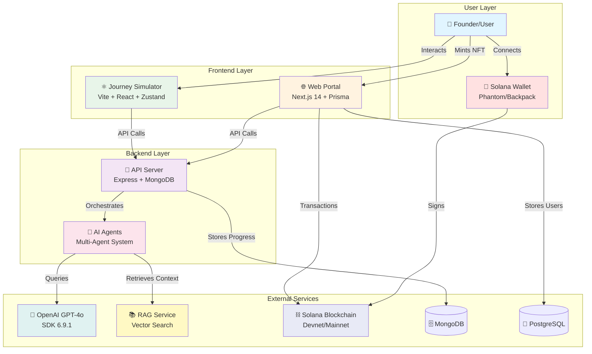
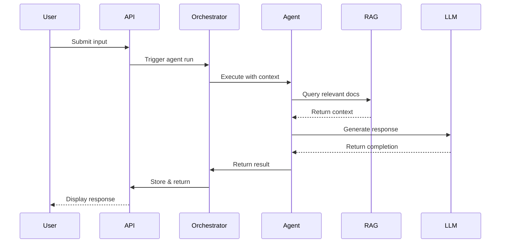
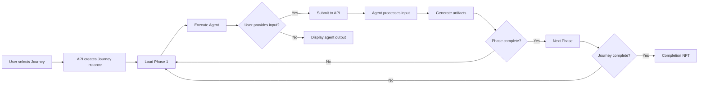
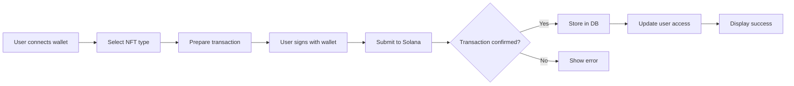
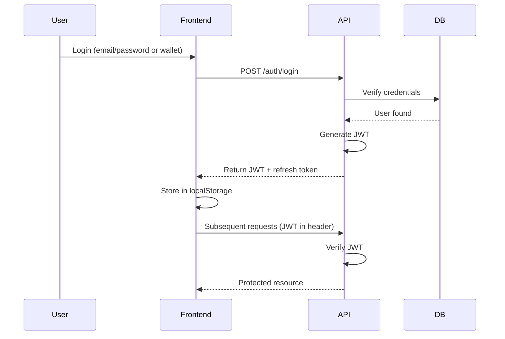

<!-- Production Ready - 2026 | Contributors: Alaeddine BEN RHOUMA, Kamel BEN RHOUMA, Adem BELHAJAISSA -->

<!-- Production Ready - 2026 | Contributors: Alaeddine BEN RHOUMA, Kamel BEN RHOUMA, Adem BELHAJAISSA -->

<!-- Production Ready - 2026 | Contributors: Alaeddine BEN RHOUMA, Kamel BEN RHOUMA, Adem BELHAJAISSA -->

# 🏗️ Architecture - Money Factory AI

## System Overview

Money Factory AI - Journey Simulator is a full-stack Web3 + AI platform built as a monorepo with three main components:



---

## Component Details

### 1. Journey Simulator (Frontend)

**Tech Stack**:

- React 19.0.0
- TypeScript 5.3.3
- Vite 4.5.14
- Zustand 4.4.1
- React Router 7.6.3
- Tailwind CSS 3.3.5
- Framer Motion 12.23.0
- Lucide React 0.556.0
- Solana Wallet Adapter (various)

**Responsibilities**:

- User interface for Cognitive Activation Protocol™
- Journey selection and navigation
- Phase progression tracking
- Agent interaction UI
- Resource/artifact display

**Key Features**:

- Wallet integration (`@solana/wallet-adapter`)
- Real-time agent feedback
- Progress persistence (localStorage + API)
- Storybook component library
- E2E tests (Playwright)

**API Endpoints Used**:

- `GET /journeys` - List available journeys
- `POST /journey/{id}/step` - Execute next step
- `POST /journey/{id}/submit` - Submit user input
- `GET /journey/user-progress` - Get user progress
- `GET /agents/logs` - Get agent activity logs

---

### 2. Web Portal (Next.js)

**Tech Stack**:

- Next.js 14.2.33 (App Router)
- React 18.3.1
- Prisma 5.22.0
- PostgreSQL
- Redis 5.10.0
- BullMQ 5.65.0
- UMI/Metaplex 3.4.0

**Responsibilities**:

- NFT minting interface
- Access pass management
- Admin dashboard
- User authentication
- Web3 gating

**Key Features**:

- Server-side rendering (SSR)
- Solana wallet integration
- NFT mint flow (Candy Machine or custom)
- Database-backed user management
- Admin tools

**Database Schema** (Prisma):

```prisma
model User {
  id        String   @id @default(cuid())
  email     String   @unique
  wallet    String?
  createdAt DateTime @default(now())
  nftMints  NftMint[]
}

model NftMint {
  id          String   @id @default(cuid())
  userId      String
  wallet      String
  mintAddress String
  txId        String
  type        String   // "access_pass", "completion_badge"
  timestamp   DateTime @default(now())
  user        User     @relation(fields: [userId], references: [id])
}
```

---

### 3. API Server (Backend)

**Tech Stack**:

- Node.js >= 18.0.0
- Express 4.21.2
- MongoDB (Mongoose 8.10.0)
- JWT (jsonwebtoken 9.0.2)
- OpenAI 6.9.1
- Zod 3.25.76
- Pino 10.1.0

**Responsibilities**:

- User authentication & authorization
- Journey orchestration
- Multi-agent coordination
- Progress tracking
- Analytics & logging

**Key Endpoints**:

| Method | Endpoint | Description |
|--------|----------|-------------|
| POST | `/auth/login` | User login |
| POST | `/auth/register` | User registration |
| GET | `/user/profile` | Get user profile |
| GET | `/journeys` | List journeys |
| POST | `/journey/{id}/step` | Execute journey step |
| POST | `/journey/{id}/submit` | Submit user response |
| GET | `/journey/user-progress` | Get progress |
| POST | `/orchestration` | Run agent orchestration |
| GET | `/agents/logs` | Get agent logs |

**MongoDB Collections**:

- `users` - User accounts
- `journeys` - Journey instances
- `agentRuns` - Agent execution logs
- `resources` - Generated artifacts
- `analytics` - Usage metrics

---

### 4. AI Agents System

**Architecture**: Multi-agent orchestration with specialized agents

**Agent Types**:

- **CoachAgent**: Guidance & coaching
- **BuilderAgent**: Technical architecture
- **GrowthAgent**: Marketing & growth
- **DAOAgent**: Governance & DAO design
- **ResearchAgent**: Market research
- **PitchAgent**: Investor pitch preparation

**Agent Workflow**:



**Agent Configuration** (example):

```json
{
  "agentId": "CoachAgent",
  "role": "Coaching & guidance",
  "systemPrompt": "You are a startup coach...",
  "ragCorpus": ["foundations", "leadership"],
  "tools": ["search", "summarize"],
  "temperature": 0.4,
  "maxTokens": 1500
}
```

---

## Data Flow

### Journey Execution Flow



### NFT Mint Flow



---

## Security Architecture

### Authentication Flow



### Key Storage

| Key Type | Storage Location | Access |
|----------|------------------|--------|
| OpenAI API Key | Backend `.env` | Server only |
| RAG API Key | Backend `.env` | Server only |
| JWT Secret | Backend `.env` | Server only |
| MongoDB URI | Backend `.env` | Server only |
| User Wallet Keys | User's wallet app | User only |
| Hot Wallet (if any) | KMS/HSM | Automated processes |

---

## Deployment Architecture

### Development

```
┌─────────────────┐
│  Developer PC   │
├─────────────────┤
│ journey-sim:5173│
│ web:3001        │
│ mf-back:3002    │
│ mongo:27017     │
│ postgres:5432   │
└─────────────────┘
```

### Production

```
┌──────────────────────────────────┐
│         journey.mfai.app         │
├──────────────────────────────────┤
│  Nginx (HTTPS, reverse proxy)    │
├──────────────────────────────────┤
│  Docker Compose:                 │
│  ┌────────────┬────────────────┐ │
│  │ mfai-web   │ mfai-api       │ │
│  │ (Next.js)  │ (Express)      │ │
│  │ :3003      │ :3002          │ │
│  └────────────┴────────────────┘ │
│  ┌────────────┬────────────────┐ │
│  │ mfai-mongo │ mfai-postgres  │ │
│  │ :27017     │ :5432          │ │
│  └────────────┴────────────────┘ │
└──────────────────────────────────┘
         │              │
         ▼              ▼
    Solana RPC     OpenAI API
```

---

## Technology Stack Summary

| Layer | Technologies |
|-------|-------------|
| **Frontend** | React 19, TypeScript 5.3, Vite 4.5, Zustand 4.4, Tailwind CSS 3.3, Framer Motion 12.23 |
| **Web Portal** | Next.js 14.2, React 18.3, Prisma 5.22, PostgreSQL, Redis 5.10, BullMQ 5.65 |
| **Backend** | Node.js 18+, Express 4.21, MongoDB (Mongoose 8.10), JWT 9.0, OpenAI 6.9 |
| **AI** | OpenAI GPT-4o (SDK 6.9.1), RAG (vector search), 23 Zyno Agents |
| **Web3** | Solana, @solana/wallet-adapter, UMI/Metaplex 3.4 |
| **Testing** | Vitest 4.0, Playwright 1.56+, Jest 29.7 |
| **DevOps** | Docker, Docker Compose, Nginx |
| **Docs** | Storybook, Markdown |

---

## Performance Considerations

### Caching Strategy

- **Frontend**: localStorage for user progress
- **Backend**: Redis (future) for session data
- **RAG**: Vector index caching
- **Solana**: RPC response caching

### Scalability

- **Horizontal**: Multiple API instances behind load balancer
- **Vertical**: Increase MongoDB/PostgreSQL resources
- **CDN**: Static assets via CDN
- **Queue**: Background jobs for heavy AI processing

---

## Monitoring & Observability

### Metrics to Track

- API response times
- Agent execution duration
- LLM token usage
- Solana transaction success rate
- User journey completion rate
- Error rates by endpoint

### Logging

- Structured JSON logs
- Centralized log aggregation (future: ELK stack)
- Alert on critical errors
- Audit trail for admin actions

---

## 👥 Contributeurs

**Équipe Money Factory AI** :

- **Kamel BEN RHOUMA** : Cofondateur et Full Stack Developer
- **Alaeddine BEN RHOUMA** : Cofondateur et Chief Operating & Blockchain Officer
- **Adem Behajaissa** : Backend Stack Developer

---

**Last Updated**: 2025-12-27
**Version**: 0.0.1
**Status**: Production-ready, 0 Bugs, Technical Debt: 59.8h
