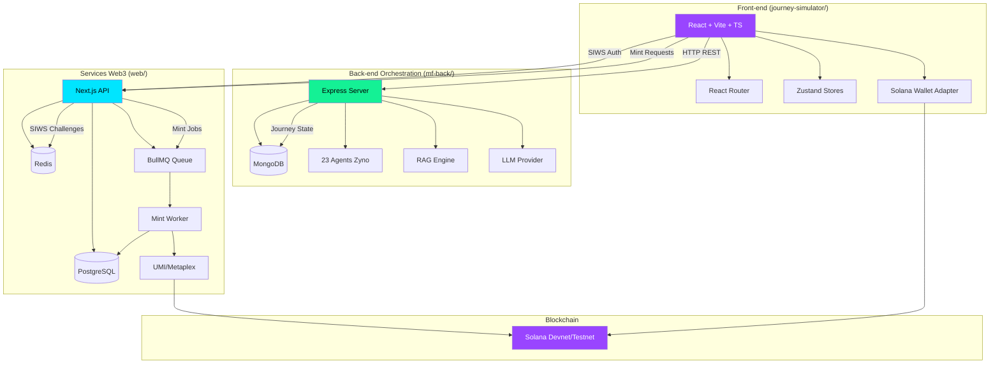
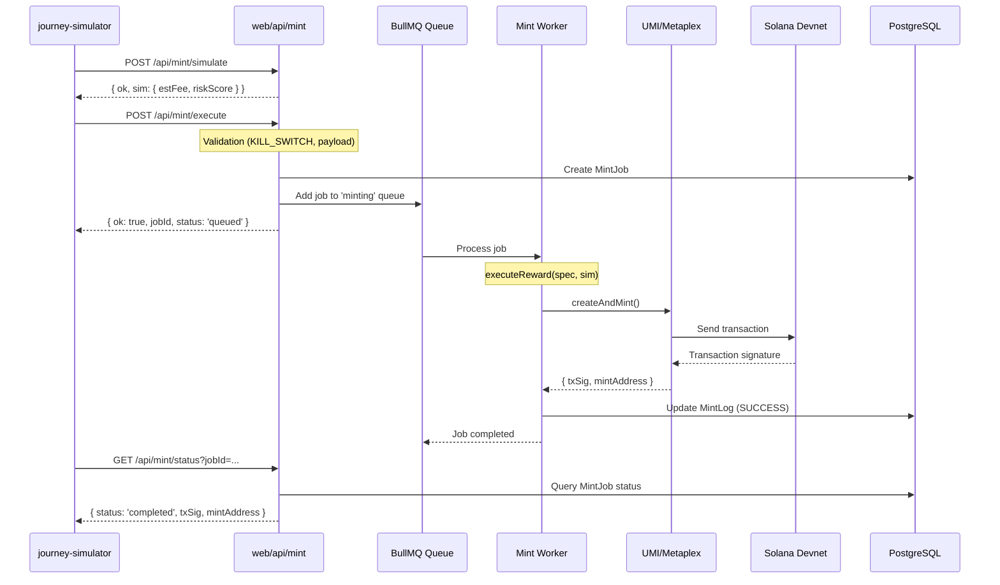
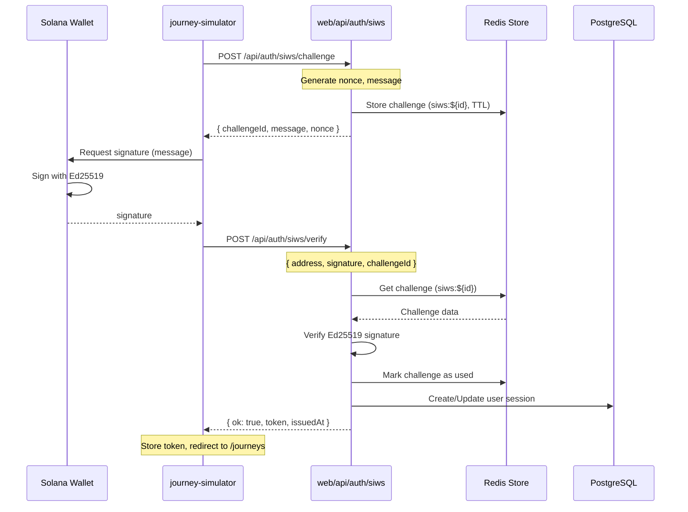
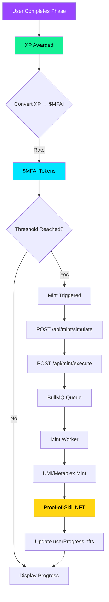
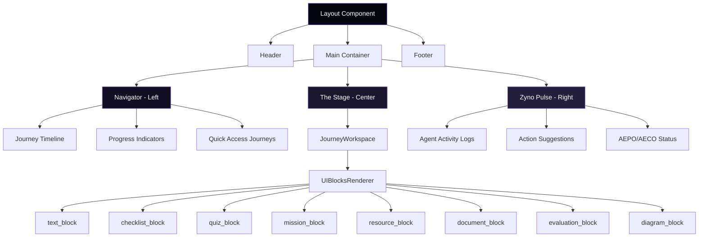

# Diagrammes d'Architecture - Money Factory AI

Ce document contient les diagrammes Mermaid illustrant l'architecture du monorepo et les pipelines clés.

---

## Architecture Monorepo

---

## Pipeline de Minting Asynchrone

---

## Workflow Auth SIWS (Sign-In With Solana)

---

## Orchestration Agentique (R2.x)

```mermaid
graph LR
    Input[User Input] --> Intent[Intent Router]
    Intent --> Select[Agent Selection]
    Select -->|Scoring| Agents[23 Agents Zyno]

    Agents -->|Parallel| Exec[Agent Execution]
    Exec --> RAG[RAG Query]
    Exec --> LLM[LLM Call]

    RAG --> Arbitrage[Arbitrage Zyno]
    LLM --> Arbitrage

    Arbitrage -->|Detect| Contradictions[Contradictions?]
    Contradictions -->|Yes| Resolve[Resolve Conflicts]
    Contradictions -->|No| Decision[Decision Structurée]
    Resolve --> Decision

    Decision --> Plan[Execution Plan]
    Plan --> Gate{Execution Gate}

    Gate -->|PENDING| HITL[Human-in-the-Loop]
    Gate -->|APPROVED| Real[REAL Execution]
    Gate -->|REJECTED| DryRun[DRY_RUN Fallback]
    Gate -->|EXPIRED| DryRun

    HITL -->|APPROVED| Real
    HITL -->|REJECTED| DryRun

    Real --> Tools[Tools Registry]
    DryRun --> Simulate[Simulate Tools]

    Tools --> Response[Structured Response]
    Simulate --> Response

    Response --> UI[UI Blocks Renderer]

    style Input fill:#9945FF,color:#fff
    style Agents fill:#14F195,color:#000
    style Gate fill:#FFD512,color:#000
    style Real fill:#FF4F4F,color:#fff
    style DryRun fill:#00E5FF,color:#000
```

---

## SkillChain Mining Flow

---

## Trinity Layout Structure

---

**Note** : Ces diagrammes sont générés avec Mermaid et peuvent être rendus dans tout viewer Markdown compatible (GitHub, GitLab, VS Code avec extension Mermaid, etc.).
