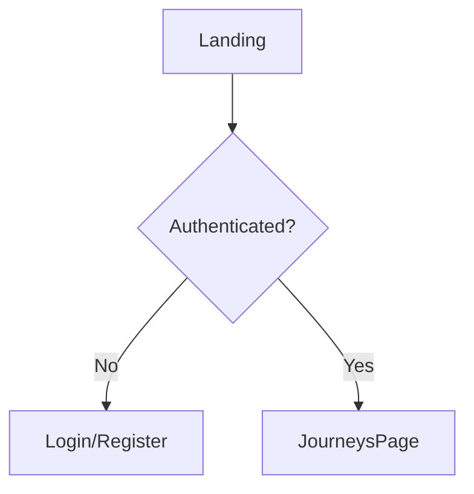

# 📦 Installation MermaidChart dans Cursor

*Guide pour installer l'extension MermaidChart.vscode-mermaid-chart-2.3.0.vsix dans Cursor*

---

## 🎯 Méthode 1 : Via l'Interface Cursor (Recommandé)

### Étapes

1. **Ouvrir Cursor**

2. **Ouvrir le panneau Extensions**
   - Raccourci : `Ctrl+Shift+X` (ou `Cmd+Shift+X` sur Mac)
   - Ou : Cliquer sur l'icône Extensions dans la barre latérale gauche

3. **Installer depuis VSIX**
   - Cliquer sur les **`...`** (trois points) en haut du panneau Extensions
   - Sélectionner **"Install from VSIX..."**
   - Naviguer vers le fichier `MermaidChart.vscode-mermaid-chart-2.3.0.vsix`
   - Sélectionner le fichier et cliquer **"Install"**

4. **Redémarrer Cursor**
   - Cursor peut demander de redémarrer pour activer l'extension
   - Cliquer sur **"Reload"** ou redémarrer manuellement

---

## 🎯 Méthode 2 : Via la Ligne de Commande

### Étapes

1. **Ouvrir un terminal**

2. **Installer l'extension**

   ```bash
   cursor --install-extension /chemin/vers/MermaidChart.vscode-mermaid-chart-2.3.0.vsix
   ```

   **Exemple** (si le fichier est dans Downloads) :

   ```bash
   cursor --install-extension ~/Downloads/MermaidChart.vscode-mermaid-chart-2.3.0.vsix
   ```

   **Ou avec chemin absolu** :

   ```bash
   cursor --install-extension /home/alaeddine/Downloads/MermaidChart.vscode-mermaid-chart-2.3.0.vsix
   ```

3. **Redémarrer Cursor**
   - Fermer et rouvrir Cursor pour activer l'extension

---

## ✅ Vérification de l'Installation

### Vérifier que l'extension est installée

1. **Ouvrir le panneau Extensions** (`Ctrl+Shift+X`)
2. **Rechercher "MermaidChart"**
3. **Vérifier** que l'extension apparaît dans la liste "Installed"

### Tester l'extension

1. **Créer un fichier** `.md` avec du contenu Mermaid :

   ```markdown
   # Test Mermaid

   ```mermaid
   graph TD
       A[Start] --> B[Process]
       B --> C[End]
   ```

   ```

2. **Ouvrir le fichier** dans Cursor
3. **Vérifier** que les diagrammes Mermaid sont rendus correctement

---

## 🔧 Utilisation de MermaidChart

### Fonctionnalités

- **Rendu des diagrammes Mermaid** dans les fichiers Markdown
- **Export** des diagrammes en PNG/SVG
- **Édition visuelle** des diagrammes (si supporté par la version)
- **Prévisualisation** en temps réel

### Commandes disponibles

1. **Ouvrir la palette de commandes** : `Ctrl+Shift+P` (ou `Cmd+Shift+P` sur Mac)
2. **Rechercher "Mermaid"** pour voir toutes les commandes disponibles

---

## 🐛 Dépannage

### L'extension ne s'installe pas

**Problème** : Erreur lors de l'installation

**Solutions** :

1. Vérifier que le fichier `.vsix` n'est pas corrompu
2. Vérifier les permissions du fichier : `chmod +r MermaidChart.vscode-mermaid-chart-2.3.0.vsix`
3. Essayer la méthode alternative (ligne de commande ou interface)

### L'extension ne fonctionne pas

**Problème** : Les diagrammes Mermaid ne s'affichent pas

**Solutions** :

1. Redémarrer Cursor complètement
2. Vérifier que l'extension est activée dans les Extensions
3. Vérifier la syntaxe Mermaid (doit être dans un bloc de code avec `mermaid`)
4. Vérifier les logs : `Help` → `Toggle Developer Tools` → Console

### Erreur de compatibilité

**Problème** : Extension incompatible avec la version de Cursor

**Solutions** :

1. Mettre à jour Cursor vers la dernière version
2. Vérifier la version minimale requise de l'extension
3. Contacter le support MermaidChart si nécessaire

---

## 📚 Ressources

- **Documentation MermaidChart** : <https://www.mermaidchart.com/docs>
- **Documentation Mermaid** : <https://mermaid.js.org/>
- **Extension VS Code** : <https://marketplace.visualstudio.com/items?itemName=MermaidChart.vscode-mermaid-chart>

---

## 💡 Astuce

Pour utiliser MermaidChart avec les diagrammes dans votre documentation :

1. **Créer des fichiers** `.md` avec des diagrammes Mermaid
2. **Ouvrir** les fichiers dans Cursor
3. **Visualiser** les diagrammes directement dans l'éditeur
4. **Exporter** si nécessaire pour la documentation

**Exemple** dans `docs/UI_UX_USER_FLOWS.md` :

```markdown


```

---

## 👥 Contributeurs

**Équipe Money Factory AI** :

- **Kamel BEN RHOUMA** : Cofondateur et Full Stack Developer
- **Alaeddine BEN RHOUMA** : Cofondateur et Chief Operating & Blockchain Officer
- **Adem Behajaissa** : Backend Stack Developer

---

**Dernière mise à jour** : Décembre 2025
