# 📊 Guide MermaidChart - Documentation du Projet

*Guide complet pour créer des diagrammes et graphiques avec MermaidChart dans Cursor*

---

## 🎯 Vue d'Ensemble

MermaidChart permet de créer des diagrammes Mermaid directement dans Cursor et de les visualiser/éditer de manière interactive. Ce guide vous montre comment documenter le projet Money Factory AI avec des diagrammes détaillés.

---

## 🚀 Utilisation de Base

### 1. Créer un Diagramme Mermaid

Dans n'importe quel fichier `.md`, créez un bloc de code avec la syntaxe Mermaid :

````markdown
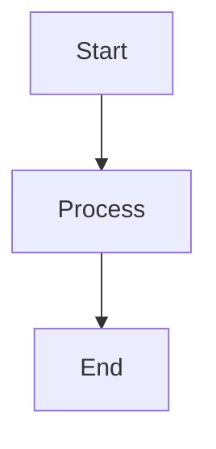
````

### 2. Visualiser dans Cursor

1. **Ouvrir** le fichier `.md` dans Cursor
2. **Placer le curseur** sur le bloc Mermaid
3. **Cliquer** sur l'icône de prévisualisation (si disponible)
4. **Ou** utiliser la commande : `Ctrl+Shift+P` → "Mermaid: Preview"

### 3. Éditer Visuellement (si supporté)

1. **Ouvrir** la palette de commandes : `Ctrl+Shift+P`
2. **Rechercher** "Mermaid: Edit Diagram"
3. **Éditer** le diagramme dans l'éditeur visuel
4. **Sauvegarder** pour mettre à jour le code Mermaid

---

## 📐 Types de Diagrammes pour le Projet

### 1. Architecture Système

**Fichier** : `docs/ARCHITECTURE_DIAGRAMS.md`

#### Architecture Monorepo

````markdown
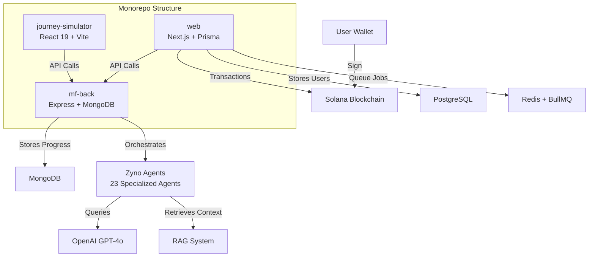
````

#### Flux de Données Principal

````markdown
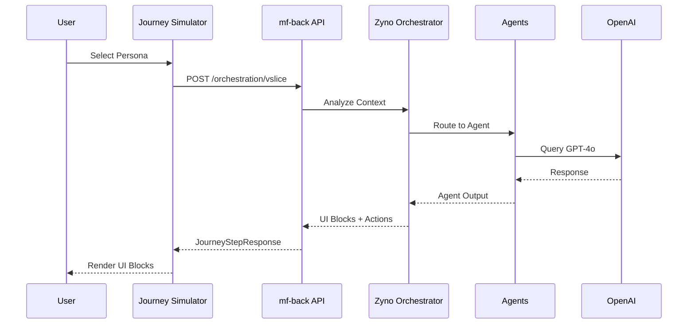
````

---

### 2. Flux Utilisateur

**Fichier** : `docs/UI_UX_USER_FLOWS.md` (déjà présent, à enrichir)

#### Flux d'Onboarding Complet

````markdown
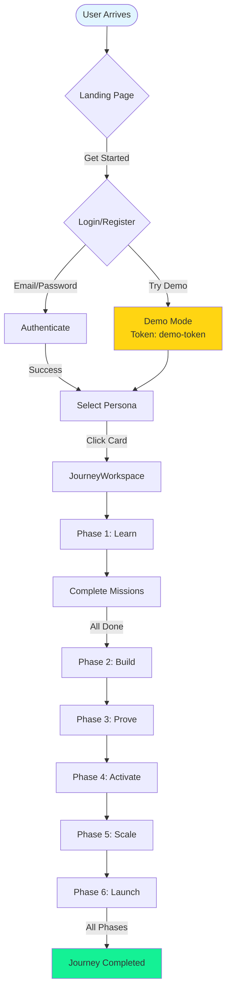
````

#### Flux de Mission

````markdown
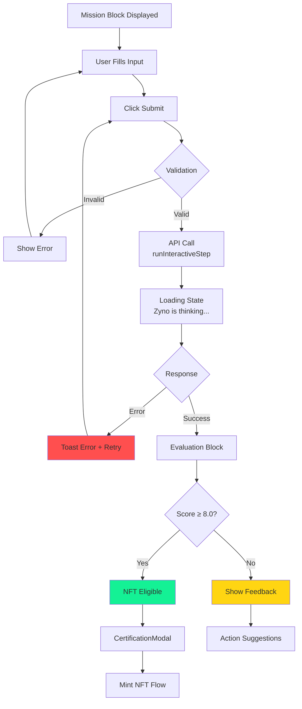
````

---

### 3. Architecture UI - Trinity Layout

**Fichier** : `docs/UI_UX_DESIGN_GUIDE.md` (à enrichir)

````markdown
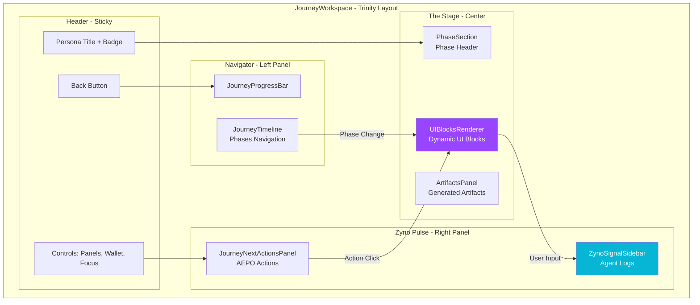
````

---

### 4. Composants UI - Hiérarchie

**Fichier** : `docs/UI_UX_COMPONENT_LIBRARY.md` (à enrichir)

````markdown
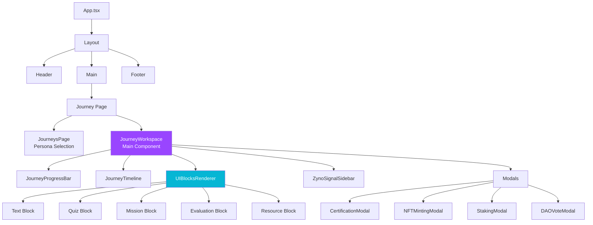
````

---

### 5. State Management - Zustand Store

**Fichier** : `docs/UI_UX_TECHNICAL_REFERENCE.md` (à enrichir)

````markdown
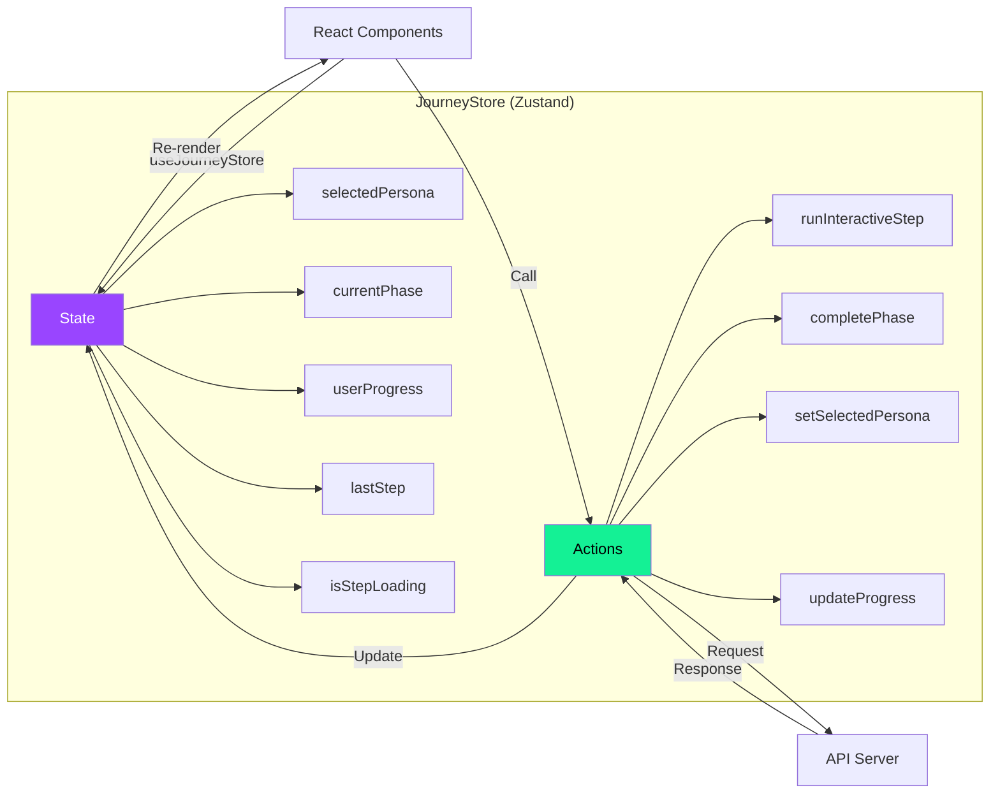
````

---

### 6. Zyno Orchestrator - Architecture Agents

**Fichier** : `docs/ARCHITECTURE.md` (à enrichir)

````markdown
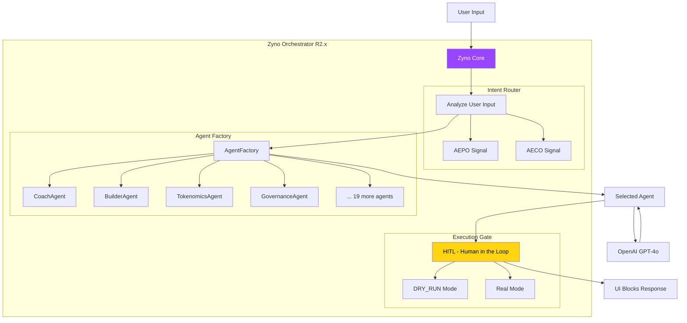
````

---

### 7. Flux de Données - API Integration

````markdown
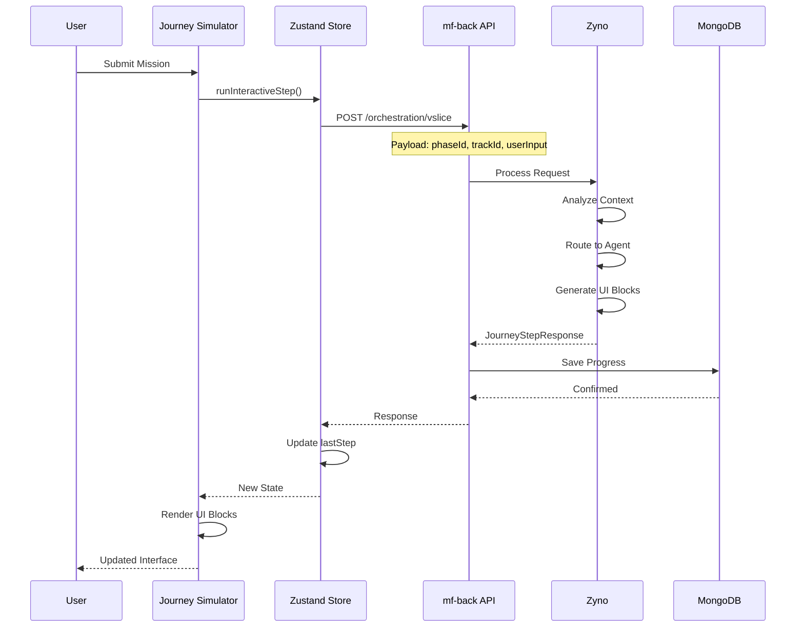
````

---

### 8. Personas & Phases

````markdown
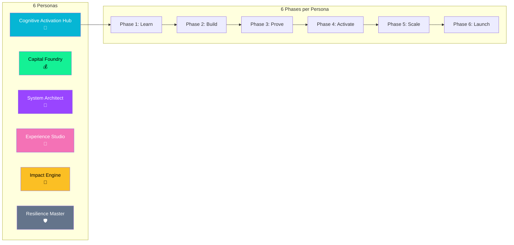
````

---

### 9. NFT Minting Flow

````markdown
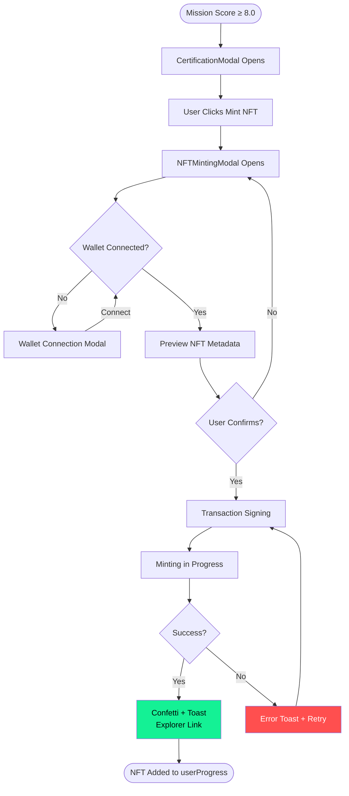
````

---

### 10. Database Schema

````markdown
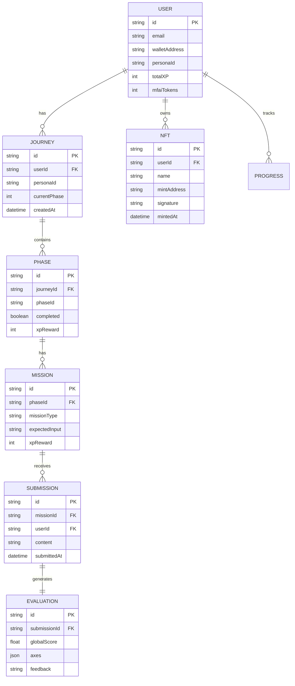
````

---

## 🎨 Templates Réutilisables

### Template : Flowchart Simple

````markdown
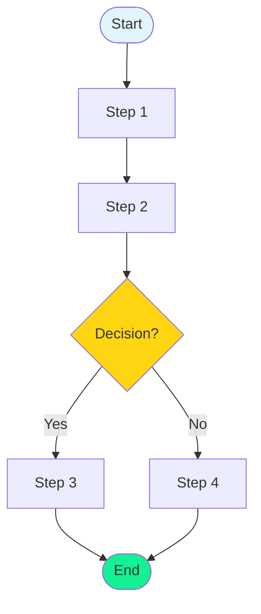
````

### Template : Sequence Diagram

````markdown
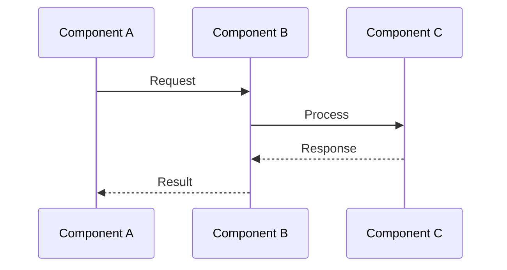
````

### Template : Architecture Graph

````markdown
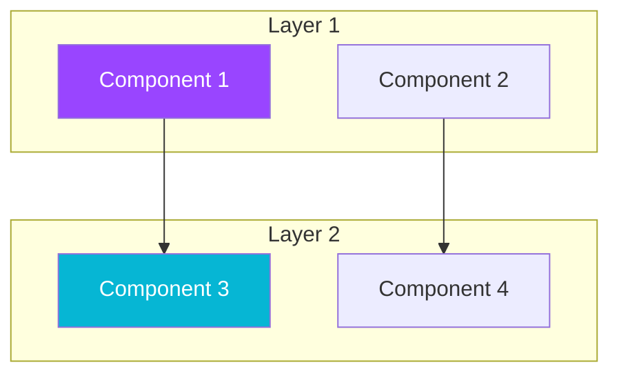
````

---

## 📝 Intégration dans la Documentation

### 1. Créer un Fichier Dédié

Créer `docs/ARCHITECTURE_DIAGRAMS.md` pour centraliser tous les diagrammes d'architecture.

### 2. Ajouter aux Documents Existants

Ajouter des diagrammes Mermaid dans :

- `docs/ARCHITECTURE.md` : Diagrammes d'architecture système
- `docs/UI_UX_USER_FLOWS.md` : Flux utilisateur (déjà présent)
- `docs/UI_UX_DESIGN_GUIDE.md` : Architecture UI
- `docs/UI_UX_TECHNICAL_REFERENCE.md` : State management, API

### 3. Référencer dans l'Index

Mettre à jour `docs/UI_UX_INDEX.md` pour référencer les nouveaux diagrammes.

---

## 🛠️ Commandes Utiles MermaidChart

### Dans Cursor

1. **Prévisualiser** : `Ctrl+Shift+P` → "Mermaid: Preview"
2. **Éditer** : `Ctrl+Shift+P` → "Mermaid: Edit Diagram"
3. **Exporter PNG** : `Ctrl+Shift+P` → "Mermaid: Export PNG"
4. **Exporter SVG** : `Ctrl+Shift+P` → "Mermaid: Export SVG"

### Raccourcis Clavier

- **Toggle Preview** : `Alt+M` (peut varier selon configuration)
- **Export** : `Ctrl+Shift+E` (peut varier)

---

## 💡 Bonnes Pratiques

### 1. Nommage des Nœuds

✅ **Bon** :

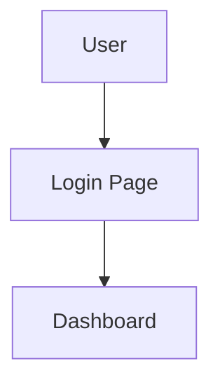

❌ **Éviter** :

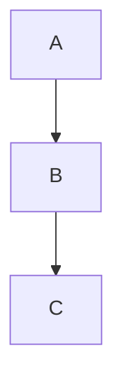

### 2. Couleurs Cohérentes

Utiliser les couleurs du design system :

- **Primary** : `#9945ff` (Solana Purple)
- **Success** : `#14f195` (Solana Green)
- **Warning** : `#ffd512` (Gold)
- **Danger** : `#ff4f4f` (Red)
- **Info** : `#06b6d4` (Cyan)

### 3. Groupement Logique

Utiliser `subgraph` pour regrouper les éléments liés :

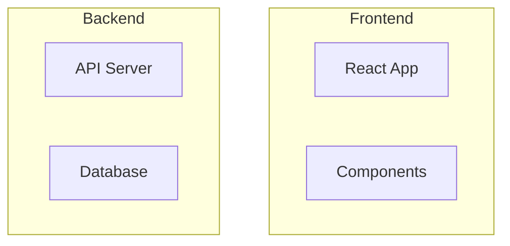

### 4. Légendes et Notes

Ajouter des notes pour clarifier :

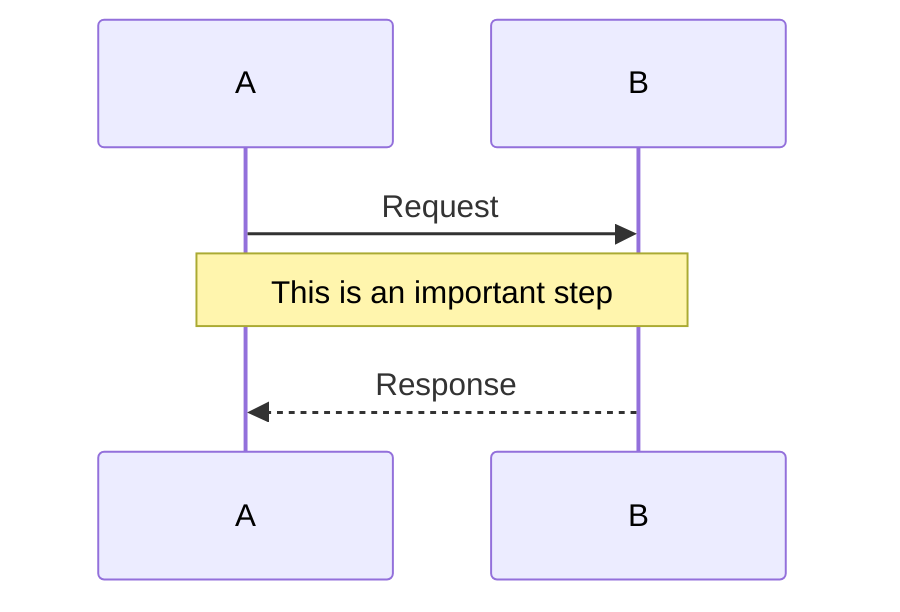

---

## 🎯 Prochaines Étapes

### 1. Créer les Diagrammes Principaux

- [ ] Architecture monorepo complète
- [ ] Flux de données API détaillé
- [ ] Architecture Zyno avec tous les agents
- [ ] Schéma de base de données complet
- [ ] Flux utilisateur pour chaque persona

### 2. Intégrer dans la Documentation

- [ ] Ajouter aux fichiers existants
- [ ] Créer `docs/ARCHITECTURE_DIAGRAMS.md`
- [ ] Mettre à jour les index

### 3. Maintenir à Jour

- [ ] Mettre à jour les diagrammes lors des changements
- [ ] Versionner les diagrammes importants
- [ ] Documenter les changements majeurs

---

## 📚 Ressources

- **Documentation Mermaid** : <https://mermaid.js.org/>
- **Mermaid Live Editor** : <https://mermaid.live/>
- **MermaidChart Docs** : <https://www.mermaidchart.com/docs>
- **Syntaxe Mermaid** : <https://mermaid.js.org/syntax/>

---

## 👥 Contributeurs

**Équipe Money Factory AI** :

- **Kamel BEN RHOUMA** : Cofondateur et Full Stack Developer
- **Alaeddine BEN RHOUMA** : Cofondateur et Chief Operating & Blockchain Officer
- **Adem Behajaissa** : Backend Stack Developer

---

**Dernière mise à jour** : Décembre 2025
