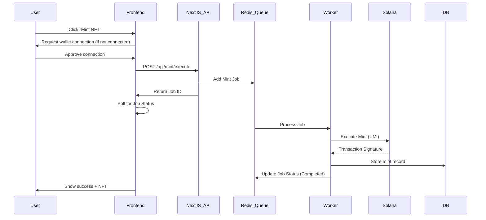

# 🌐 Web3 Integration Guide

## Overview

This document describes the Web3 integration for Money Factory AI - Journey Simulator, focusing on Solana blockchain integration, wallet connectivity, and NFT minting.

---

## 🔗 Wallet Integration

### Supported Wallets

- **Phantom** (Primary - Desktop & Mobile)
- **Backpack** (Desktop & Mobile)
- **Solflare** (Desktop)
- **Torus** (Web-based)
- **Ledger** (Hardware wallet)

### Implementation

**Library**: `@solana/wallet-adapter-react`

**Configuration** (see `journey-simulator/src/lib/solana-config.ts`):
```typescript
import { createConnection, SUPPORTED_WALLETS } from '@/lib/solana-config';

const connection = createConnection();
```

### Desktop Wallet Connection

1. User clicks "Connect Wallet"
2. Wallet adapter modal displays available wallets
3. User selects wallet (e.g., Phantom)
4. Browser extension prompts for approval
5. Connection established

### Mobile Wallet Connection

1. User clicks "Connect Wallet" on mobile browser
2. Deep link redirects to wallet app (Phantom/Backpack)
3. User approves connection in wallet app
4. Redirected back to web app with connection established

**Deep Link Format**:
```
phantom://browse/https://journey.mfai.app?action=connect
```

---

## 🎨 NFT Minting Flow

### Overview

Money Factory AI uses NFTs for:
1. **Access Passes** - Grant access to premium features
2. **Completion Badges** - Certify journey completion
3. **Proof-of-Skill™** - Validate specific achievements

### Mint Flow Architecture



---

## 🏗️ Implementation Details

### 1. Mint Endpoint (Next.js API Route)

**File**: `web/app/api/mint/execute/route.ts`

```typescript
import { NextResponse } from 'next/server'
import { mintQueue } from '@/server/queue' // BullMQ Queue

export async function POST(req: Request) {
  const { spec, sim } = await req.json()

  // Add job to queue for background processing
  const job = await mintQueue.add('mint-nft', {
    spec,
    sim,
    userId: req.headers.get('x-user-id'),
  })

  return NextResponse.json({ ok: true, jobId: job.id, status: 'queued' })
}
```

### 2. Worker & UMI Implementation

**File**: `web/packages/agents/tools/solana.ts`

```typescript
import { createUmi } from '@metaplex-foundation/umi-bundle-defaults'
import { createAndMint, TokenStandard } from '@metaplex-foundation/mpl-token-metadata'

export async function executeReward(spec: RewardSpec) {
  const umi = createMinterUmi() // Configured with secret key
  const mint = generateSigner(umi)

  const builder = createAndMint(umi, {
    mint,
    authority: umi.identity,
    name: spec.name,
    uri: spec.uri,
    tokenOwner: publicKey(spec.recipient),
    tokenStandard: TokenStandard.NonFungible,
  })

  const result = await builder.sendAndConfirm(umi, {
    confirm: { commitment: 'confirmed' },
  })

  return { txSig: base58.deserialize(result.signature)[0] }
}
```

### 3. Frontend Signing & Submission

**File**: `journey-simulator/src/components/MintNFT.tsx`

```typescript
import { useWallet } from '@solana/wallet-adapter-react';
import { Transaction } from '@solana/web3.js';
import { createConnection } from '@/lib/solana-config';

async function handleMint() {
  const { publicKey, signTransaction } = useWallet();
  
  // 1. Request unsigned transaction from API
  const response = await fetch('/api/mint', {
    method: 'POST',
    body: JSON.stringify({
      walletAddress: publicKey.toString(),
      nftType: 'completion_badge',
      journeyId: currentJourneyId
    })
  });
  
  const { transaction: serializedTx } = await response.json();
  
  // 2. Deserialize and sign
  const transaction = Transaction.from(Buffer.from(serializedTx, 'base64'));
  const signedTx = await signTransaction(transaction);
  
  // 3. Submit to Solana
  const connection = createConnection();
  const signature = await connection.sendRawTransaction(signedTx.serialize());
  
  // 4. Confirm transaction
  await connection.confirmTransaction(signature, 'confirmed');
  
  // 5. Store mint record
  await fetch('/api/mint/confirm', {
    method: 'POST',
    body: JSON.stringify({
      signature,
      walletAddress: publicKey.toString(),
      nftType: 'completion_badge'
    })
  });
  
  return signature;
}
```

---

## 💾 Database Schema

### Prisma Model

**File**: `web/prisma/schema.prisma`

```prisma
model NftMint {
  id          String   @id @default(cuid())
  userId      String
  wallet      String
  mintAddress String   @unique
  txId        String   @unique
  type        String   // "access_pass", "completion_badge", "proof_of_skill"
  journeyId   String?
  phaseId     String?
  metadata    Json?    // Additional metadata (score, rarity, etc.)
  timestamp   DateTime @default(now())
  
  user        User     @relation(fields: [userId], references: [id])
  
  @@index([userId])
  @@index([wallet])
  @@index([type])
}

model User {
  id        String    @id @default(cuid())
  email     String    @unique
  wallet    String?   @unique
  nftMints  NftMint[]
  // ... other fields
}
```

---

## 🎯 NFT Types & Metadata

### 1. Access Pass

**Purpose**: Grant access to premium features

**Metadata**:
```json
{
  "name": "Money Factory AI - Access Pass",
  "symbol": "MFAI-PASS",
  "description": "Premium access to Money Factory AI platform",
  "image": "https://mfai.app/nft/access-pass.png",
  "attributes": [
    { "trait_type": "Type", "value": "Access Pass" },
    { "trait_type": "Tier", "value": "Premium" },
    { "trait_type": "Valid Until", "value": "2025-12-31" }
  ]
}
```

### 2. Completion Badge

**Purpose**: Certify journey completion

**Metadata**:
```json
{
  "name": "Journey Completion - Cognitive Activation Hub",
  "symbol": "MFAI-COMPLETE",
  "description": "Completed the Cognitive Activation Hub journey",
  "image": "https://mfai.app/nft/completion-cognitive.png",
  "attributes": [
    { "trait_type": "Type", "value": "Completion Badge" },
    { "trait_type": "Journey", "value": "Cognitive Activation Hub" },
    { "trait_type": "Completion Date", "value": "2025-11-29" },
    { "trait_type": "Total XP", "value": "1500" }
  ]
}
```

### 3. Proof-of-Skill™

**Purpose**: Validate specific achievements

**Metadata**:
```json
{
  "name": "Proof-of-Skill™ - Tokenomics Design",
  "symbol": "MFAI-SKILL",
  "description": "Demonstrated mastery in tokenomics design",
  "image": "https://mfai.app/nft/skill-tokenomics.png",
  "attributes": [
    { "trait_type": "Type", "value": "Proof-of-Skill" },
    { "trait_type": "Skill", "value": "Tokenomics Design" },
    { "trait_type": "Score", "value": "9.5/10" },
    { "trait_type": "Rarity", "value": "Epic" }
  ]
}
```

---

## 🔐 Security Considerations

### 1. Never Expose Private Keys

- ❌ **Never** store private keys in frontend
- ❌ **Never** store private keys in database (unless HSM-encrypted)
- ✅ Users sign transactions with their own wallets

### 2. Hot Wallet (if needed for subsidized mints)

**Storage**: Server-side environment variable or KMS

```typescript
// ONLY on server-side (Next.js API route)
import { Keypair } from '@solana/web3.js';

const hotWallet = Keypair.fromSecretKey(
  Buffer.from(process.env.MINTER_SECRET_KEY!, 'base64')
);

// Use ONLY for signing protocol transactions
// NEVER expose to client
```

### 3. Transaction Verification

```typescript
// Verify transaction before storing
async function verifyMint(signature: string, expectedWallet: string) {
  const connection = createConnection();
  const tx = await connection.getTransaction(signature);
  
  if (!tx || tx.meta?.err) {
    throw new Error('Transaction failed or not found');
  }
  
  // Verify the transaction matches expected parameters
  // ...
  
  return true;
}
```

---

## 📊 Monitoring & Analytics

### Track Mint Events

```typescript
// Log all mints for analytics
await logMintEvent({
  userId,
  walletAddress,
  nftType,
  txId: signature,
  timestamp: new Date(),
  network: SOLANA_NETWORK
});
```

### Metrics to Monitor

- Total mints by type
- Mint success rate
- Average transaction time
- Gas fees paid
- User wallet distribution

---

## 🧪 Testing

### Devnet Testing

1. Use devnet RPC endpoint
2. Airdrop SOL to test wallets
3. Test full mint flow
4. Verify NFT appears in wallet

### Mainnet Checklist

- [ ] Candy Machine deployed and tested
- [ ] Metadata uploaded to Arweave/IPFS
- [ ] Hot wallet funded (if subsidizing)
- [ ] Rate limiting implemented
- [ ] Error handling tested
- [ ] Transaction monitoring setup

---

## 🔗 Resources

- [Solana Web3.js Docs](https://solana-labs.github.io/solana-web3.js/)
- [Wallet Adapter Docs](https://github.com/solana-labs/wallet-adapter)
- [Metaplex Docs](https://docs.metaplex.com/)
- [Candy Machine v3](https://docs.metaplex.com/programs/candy-machine/)

---

**Last Updated**: 2025-11-29  
**Version**: 1.0

## 👥 Contributeurs

**Équipe Money Factory AI** :

- **Kamel BEN RHOUMA** : Cofondateur et Full Stack Developer
- **Alaeddine BEN RHOUMA** : Cofondateur et Chief Operating & Blockchain Officer
- **Adem Behajaissa** : Backend Stack Developer
