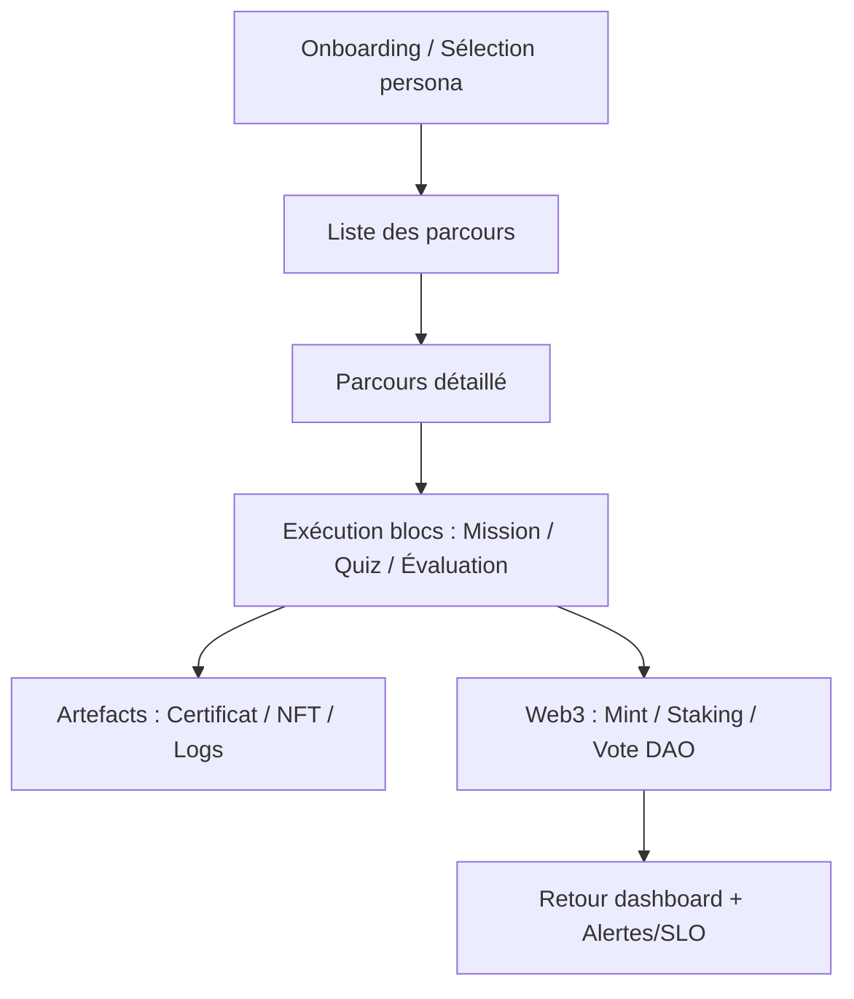
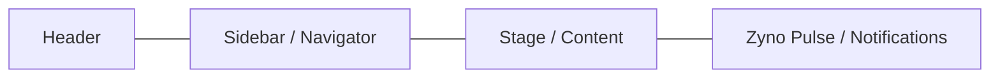
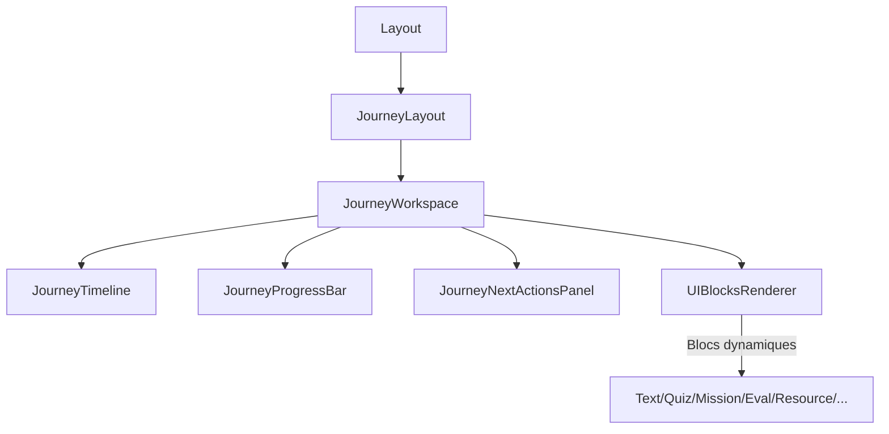
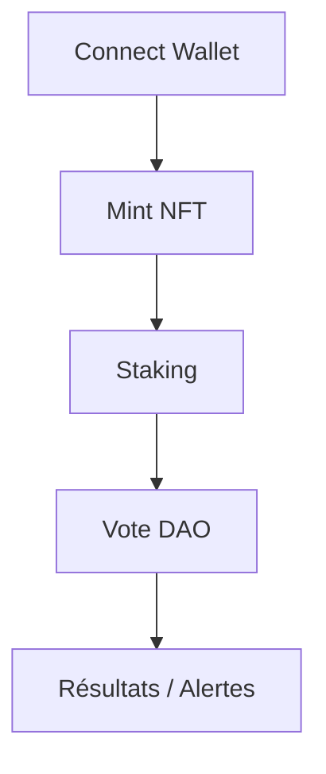
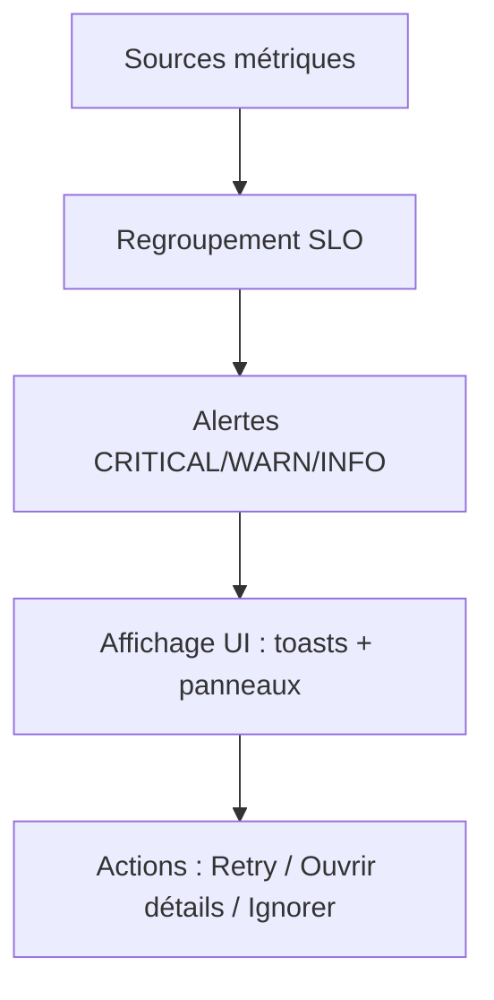
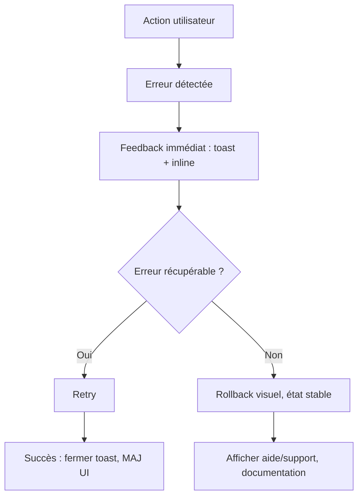
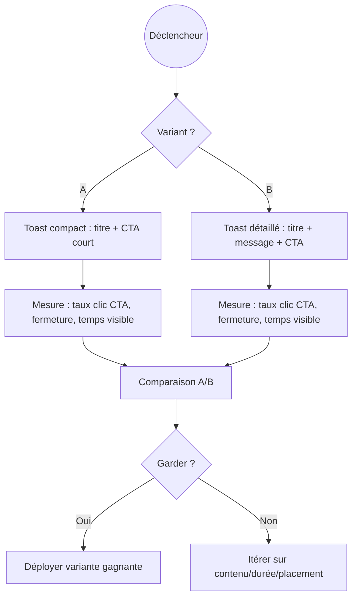
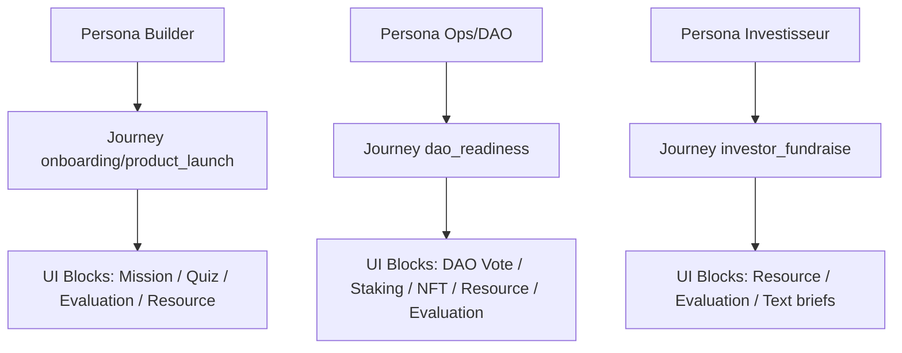

# 📘 Cahier des charges UI/UX – Money Factory AI

*Version* : 1.0 — *Dernière mise à jour* : Décembre 2025
*Public cible* : Spécialiste UI/UX (design, prototypage, delivery front)
*Périmètre* : Journey Simulator (React/Vite/TS), Web Portal (Next/Prisma), écrans Web3, dashboards, UI Blocks dynamiques.

---

## 1. Objectifs & KPIs

- Alignement métier : refléter fidèlement les parcours (onboarding, missions, quiz, évaluations, NFT, staking, DAO).
- Guidance & conversion : “où je suis / que faire maintenant / qu’est-ce qui reste ?”.
- Rétention & complétion : augmenter taux de fin de parcours, réduire abandon.
- Observabilité UX : instrumenter complétion par phase, erreurs, temps par écran.
- Accessibilité : WCAG 2.1 AA (clavier, contraste, aria).
- Performance perçue : LCP < 2.5s sur écrans clés ; feedback < 150 ms.

## 2. Personas & scénarios clés

- Builder / Apprenant : veut un chemin clair, feedback rapide, quiz/éval compréhensibles.
- Ops / DAO : veut états d’artefacts, votes, staking, conformité, alertes.
- Investisseur : veut synthèse risques/progrès en un coup d’œil.
- Admin / Demo : veut mode démo stable, parcours rejouables, résultats “showcase”.

## 3. Périmètre fonctionnel

- Navigation Trinity Layout : Header, Sidebar/Navigator, Stage (rendu blocs), Zyno Pulse/Notifications.
- UI Blocks dynamiques : Text, Quiz, Mission, Evaluation, Resource, Certification, NFT, Staking, DAO Vote, Artifacts.
- Dashboards : progression parcours, alertes/SLO, Web3 (wallet, NFT, staking, vote), coûts/agents (si dispo), artefacts.
- Web3 : connexion wallet, mint NFT, staking, vote DAO (états success/pending/erreur).
- États transverses : loading (skeleton), vide (CTA), erreur récupérable (retry), blocage (message + support), succès (résumé + next step).

## 4. Principes UI/UX

- Lisibilité/hiérarchie : titres + sous-titres + microcopy d’action.
- Guidance : timeline/progression + “next action” visible en permanence.
- Cohérence : palette, typo, espacements, élévations (card-surface, neon-border, inset-panel).
- Feedback : toasts/snag bars, inline errors, confirmations pour actions irréversibles.
- Accessibilité : focus visible, aria sur CTA/icônes, labels formulaires, contraste AA.
- Prévention d’erreur : validations, confirmations (mint, vote, staking), “are you sure?” sur actions critiques.

## 5. Architecture UI & Navigation

- Header : branding, état session, mode démo, switch réseau, accès rapide réglages.
- Sidebar/Navigator : parcours, phases, reprises rapides (mission en cours), filtres.
- Stage : rendu des UI Blocks, formulaires, quiz, ressources, modales.
- Notifications (Zyno Pulse) : alertes SLO, erreurs blocantes, succès.
- Routage : parcours → détail → exécution ; artefacts ; Web3 ; dashboard global.

## 6. Composants à auditer/rafraîchir

- Layouts : `Layout`, `JourneyLayout`, `Header`.
- Parcours : `JourneyWorkspace`, `JourneyTimeline`, `JourneyProgressBar`, `JourneyNextActionsPanel`, `JourneyCard`.
- UI Blocks : `UIBlocksRenderer` + blocs Text/Quiz/Mission/Evaluation/Resource/Certification/NFT/Staking/DAO Vote/Artifacts.
- Modales : `CertificationModal`, `NFTMintingModal`, `StakingModal`, `DAOVoteModal`.
- Web3 : boutons wallet, états réseau, erreurs signature/txn.
- Shared : boutons, inputs, selects, alert/toast, skeletons, tabs/accordions.
- Zyno : `AgentActivityFeed`, `ZynoSignalSidebar`.
- Dashboards : progression, alertes, coûts/agents (si dispo), Web3.

## 7. Flots critiques à couvrir (avec états)

- Onboarding / sélection persona / mode démo.
- Exécution parcours : phases, missions, quiz, évaluations, ressources.
- Artefacts : certificats/NFT, logs agents, ressources.
- Web3 : connexion wallet, mint, staking, vote DAO (succès/erreur/pending).
- Alertes/SLO : affichage non bloquant, regroupé par sévérité.
- États transverses : loading, vide (CTA), erreur (retry), blocage (support), succès (résumé + next step).

## 8. Dashboards : exigences

- Parcours : % complétion, phases faites, missions ouvertes/complétées.
- Alertes & SLO : liste triée (niveau, message, temps), filtres par parcours/persona.
- Web3 : état wallet, NFTs mintés, staking, votes en cours/clos.
- Agents/Coûts (si dispo) : statuts récents, temps moyen, appels LLM/RAG mock/real.
- Actions rapides : “Reprendre”, “Rejouer démo”, “Télécharger certificat/NFT”.

## 9. Design System

- Palette : contrastes AA, variantes light/dark (si requise).
- Typo : hiérarchie H1–H4, corps, légendes ; poids cohérents.
- Spacing : grille 4/8px ; paddings/margins standard.
- Élévations/états : hover/focus/active/disabled/error/success ; ombres douces.
- Composants Tailwind custom : `card-surface`, `neon-border`, `inset-panel`.
- Icônes : set cohérent, usage parcimonieux.
- Vides : micro-illustrations ou emojis sobres + CTA/action.

## 10. Accessibilité

- Clavier : tab order logique, focus visible, Enter/Space sur CTA.
- Aria : `aria-label` sur icônes/boutons, rôles modales/toasts.
- Contraste : AA texte/icone/CTA.
- Formulaires : labels associés, message d’erreur proche, aide contextuelle.
- Animations : respecter prefers-reduced-motion, durées < 250 ms pour actions critiques.

## 11. Performance perçue

- Skeletons sur listes/timelines/cards.
- Lazy-load / code splitting des blocs non visibles.
- Images optimisées (WebP, responsive), sprites/icônes inline.
- Feedback immédiat pour actions longues (spinner + texte court).

## 12. États d’erreur & résilience

- RAG/LLM down : fallback texte, “réessayer”.
- Web3 : réseau/txn refusée/pending, guidance (réouvrir wallet, vérifier réseau).
- Parcours : si données manquantes, “Recharger” ou “Contacter support” (lien).

## 13. Instrumentation & analytics

- Événements : ouverture parcours, changement phase, soumission mission/quiz, mint/vote/stake, erreurs, retries.
- Conversions : taux de complétion par phase/persona, abandons par écran, taux d’erreur.
- UX health : temps sur écran, temps de réponse perçu, alertes SLO vues.
- Logging : limiter le bruit ; catégoriser INFO/WARN/ERROR ; relier aux traces.

## 14. Plans de maquettes (attendus)

- Dashboard global : progression, alertes/SLO, Web3, actions rapides.
- Parcours (liste + détail) : timeline, phases, actions suivantes, états vides/erreurs.
- Écran exécution (Stage) : header de phase, bloc courant, CTA primaire, zone de feedback.
- UI Blocks (catalogue) : cartes de présentation + états (loading/empty/error/success).
- Modales Web3 : connexion, mint, staking, vote (success/pending/error).
- Artefacts : certificats/NFT, ressources, journaux d’agents (vue liste + détail).
- Notifications/Toasts : pile, niveaux de sévérité, CTA de récupération.

### 14.1 Wireframes textuels (schématiques)

- **Dashboard global**
  - Header : logo, statut session, mode démo, switch réseau, alert icon (badge), bouton “Rejouer démo”.
  - Bandeau KPI : cartes (Progression parcours %, Alertes actives, Web3 état wallet, Dernier artefact).
  - Section Progression : liste des parcours (titre, % complétion, bouton “Reprendre”).
  - Section Alertes/SLO : tableau trié (niveau, message, horodatage), CTA “Voir détails”.
  - Section Web3 : bloc wallet (connecté/déconnecté), boutons “Mint NFT”, “Staker”, “Voter”.
  - Section Actions rapides : “Démarrer nouveau parcours”, “Ouvrir ressources”, “Exporter certificat”.
- **Parcours – Liste**
  - Header : titre, filtre (persona, statut), recherche.
  - Cards : nom parcours, phases, dernière activité, bouton primaire “Ouvrir”.
  - État vide : illustration, texte d’aide, bouton “Démarrer en mode démo”.
- **Parcours – Détail**
  - Sidebar : phases (état : fait/en cours/à faire), badges d’alertes.
  - En-tête : titre parcours, % complétion, boutons “Reprendre”, “Rejouer démo”.
  - Timeline : jalons phases, clic = focus sur phase.
  - Bloc “Next action” : mission/quiz à faire, CTA primaire.
  - Bloc “Ressources” : liens, ouverture dans panneau latéral.
  - Alertes : liste compacte, niveau, CTA “Voir plus”.
- **Écran exécution (Stage)**
  - Barre supérieure : phase courante, temps estimé, statut (Demo/Real).
  - Zone contenu : UI Block courant (texte/quiz/mission/évaluation).
  - Panneau latéral (optionnel) : contexte, ressources liées, aide.
  - Barre inférieure : CTA principal (Soumettre/Continuer), CTA secondaire (Sauver + Quitter), feedback inline (erreur/succès).
  - États : skeleton au chargement, message d’erreur avec Retry, message vide si pas de data.
- **UI Blocks (catalogue)**
  - Grille de vignettes : nom du bloc, usage, props clés, icône.
  - Pour chaque bloc : aperçu normal, loading (skeleton), empty (texte + CTA), error (message + Retry), success (confirmation).
  - Interaction : lien “Voir doc technique” (ancre vers reference).
- **Modales Web3 (Connexion / Mint / Staking / Vote)**
  - Header : titre, sous-titre explicatif, icône état réseau.
  - Corps : résumé action (ex: NFT à minter), champs requis, coûts/fees, réseau.
  - Footer : CTA primaire (Signer/Confirmer), secondaire (Annuler), message d’attente (pending), état erreur (recommander “Réouvrir wallet”).
- **Artefacts**
  - Liste : type (certificat/NFT/log), date, statut, bouton “Voir / Télécharger / Ouvrir”.
  - Détail : aperçu, métadonnées, actions (Download, Partager, Ouvrir dans wallet).
  - État vide : “Aucun artefact généré” + bouton “Lancer un parcours”.
- **Notifications / Toasts**
  - Pile en bas à droite : variantes INFO/WARN/ERROR/SUCCESS.
  - Chaque toast : titre court, message, lien d’action, timer, bouton fermer, focusable au clavier.

### 14.2 Layouts détaillés (ligne par ligne)

- **Dashboard global (grille)**
  - Ligne 1 : Header (full width).
  - Ligne 2 : KPIs en 3–4 cartes (Progression, Alertes, Web3, Dernier artefact).
  - Ligne 3 : Colonne gauche (2/3) Progression parcours (liste + CTA “Reprendre”) ; Colonne droite (1/3) Alertes/SLO (table compacte).
  - Ligne 4 : Colonne gauche (2/3) Actions rapides (Rejouer démo, Démarrer parcours, Ouvrir ressources) ; Colonne droite (1/3) Web3 (wallet state, boutons Mint/Staker/Voter).
- **Parcours – Détail**
  - Ligne 1 : Header parcours (titre, % complétion, CTA primaire “Reprendre”, CTA secondaire “Rejouer démo”).
  - Ligne 2 : Colonne gauche (sidebar phases avec badges état + alertes), Colonne droite (Stage aperçu + “Next action”).
  - Ligne 3 : Ressources liées (liste liens), Alertes (pile compacte), Historique actions (liste courte).
- **Stage (exécution bloc)**
  - Ligne 1 : Barre supérieure (phase courante, temps estimé, statut Demo/Real, breadcrumb).
  - Ligne 2 : Zone principale bloc courant (texte/quiz/mission/éval) avec panneau latéral optionnel (contexte/ressources).
  - Ligne 3 : Barre d’action (CTA primaire Soumettre/Continuer, CTA secondaire Sauver+Quitter, feedback inline).
- **Modale Web3 (Mint/Staking/Vote)**
  - Ligne 1 : Titre + sous-titre + icône état réseau.
  - Ligne 2 : Résumé action (asset, coût/fees, réseau), champs requis.
  - Ligne 3 : État pending (spinner + message court) ou erreur (message + “Réessayer”/“Réouvrir wallet”).
  - Ligne 4 : Footer CTA primaire (Signer/Confirmer), secondaire (Annuler/Retour).
- **Artefacts (liste + détail)**
  - Liste : barre de filtre/recherche, lignes (type, date, statut, actions “Voir/Télécharger/Ouvrir”), pagination légère.
  - Détail : aperçu (certif/NFT/log), métadonnées, actions (Download, Partager, Ouvrir wallet), section “Comment l’utiliser ?”.

## 15. Graphiques / Diagrammes (Mermaid/MermaidChart)

- Flux utilisateur : onboarding → parcours → missions/quiz → artefacts → Web3 (mint/stake/vote).
- Architecture UI “Trinity” : Header / Sidebar / Stage / Pulse.
- Hiérarchie composants : Layout → JourneyLayout → Workspace → UIBlocksRenderer → Blocks.
- États & transitions Web3 : wallet connect → signature → txn pending → success/fail.
- SLO/Alertes : sources → regroupement → affichage → actions.

#### 15.1 Exemples Mermaid prêts à l’emploi

- **Flux utilisateur principal**



- **Architecture UI Trinity**



- **Hiérarchie composants (simplifiée)**



- **Web3 : Connexion → Mint → Staking → Vote**



- **SLO / Alertes**



#### 15.2 Autres diagrammes prêts à l’emploi

- **États d’erreur / retour arrière**



- **A/B des toasts (expérience notification)**



- **Escalade d’alertes critiques**

```mermaid
flowchart TD
  src[Alertes CRITICAL détectées] --> filt[Filtrage doublons et fenêtre]
  filt --> ack[Flag ACK en attente]
  ack --> brd[Broadcast UI : toasts + panneau]
  ack --> ops[Webhook/Slack/Email ops]
  brd --> usr[Utilisateur voit + CTA \"Détails\"]
  usr --> act{Résolu ?}
  act -->|Oui| clear[Marquer résolu, retirer de la pile]
  act -->|Non| escalate[Escalade L2/L3]
  escalate --> audit[Tracer dans audit/telemetry]
```

- **Mapping persona → journey → UI Blocks**



#### 15.3 Exports visuels (PNG)

- Flux utilisateur principal : `diagrams/exports/flux_principal.png`
- Architecture UI Trinity : `diagrams/exports/ui_trinity.png`
- Hiérarchie composants : `diagrams/exports/hierarchie_composants.png`
- Web3 (connexion → mint → staking → vote) : `diagrams/exports/web3_flow.png`
- SLO / Alertes : `diagrams/exports/slo_alertes.png`
- Erreur / rollback : `diagrams/exports/erreur_rollback.png`
- A/B toasts : `diagrams/exports/ab_toasts.png`
- Escalade alertes : `diagrams/exports/escalade_alertes.png`
- Mapping persona → journey → UI Blocks : `diagrams/exports/persona_journey_blocks.png`

## 16. Livrables attendus

- Audit UI/UX synthétique (quick wins + backlog P0/P1/P2).
- Wireframes hi-fi + prototype cliquable (Figma) couvrant les flots critiques.
- Spécifications UI détaillées : tokens (couleurs, typo, spacing), états, composants.
- Guide accessibilité appliqué (checklist WCAG/clavier par composant).
- Plan de tests UX : scénarios, critères d’acceptation, métriques suivies.
- Reco information architecture : navigation, regroupement panneaux, priorisation CTA.

## 17. Priorités (proposition)

- P0 : guidance parcours (timeline/next actions), états (loading/erreur/vide), cohérence modales Web3, CTA primaires.
- P1 : dashboards (progression, alertes, Web3), UI Blocks cohérents, accessibilité clavier/contraste.
- P2 : micro-interactions, vides/toasts raffinés, optimisation perçue (skeletons), raffinement visuel.

## 21. Plan de tests UX (raffiné)

- **Accessibilité** : navigation clavier complète, focus visible, aria sur CTA/icônes, labels formulaires, contrastes AA.
- **Guidance parcours** : afficher clairement phase courante, progression, next action ; vérifier CTA primaire toujours visible.
- **États transverses** : loading (skeleton), vide (CTA), erreur récupérable (Retry), blocage (message + support), succès (résumé + next step).
- **Notifications/Toasts** : lisibilité, actionnables, empilement limité, temps d’affichage, test A/B contenu/durée/placement.
- **Web3** : connexion wallet, mint/stake/vote (success/pending/error), messages d’aide en cas de refus/timeout.
- **Modales** : focus trap, fermeture via clavier, aria-modal, boutons primaires/secondaires cohérents.
- **Performance perçue** : temps d’affichage premier contenu, feedback <150 ms sur actions, lazy-load blocs non visibles.
- **Dashboards** : cohérence des chiffres (progression %, alertes), filtres fonctionnels, actions rapides disponibles.
- **Parcours/Blocks** : quiz/mission/évaluation affichent erreurs inline, validation côté client, states loading/empty/error.
- **Démo vs réel** : sorties stables en mode démo, marquage clair du mode, absence de side-effects réels.

## 18. Contraintes techniques

- Stack : React 19 + Vite + TS, Tailwind, Zustand, React Router, Framer Motion, Web3 (Solana), Next/Prisma côté portail.
- Ne pas modifier les contrats API ni la logique métier ; se limiter à UI/UX/front.
- Réutiliser les composants existants ; respecter les conventions de style (Tailwind utilitaires + classes custom).

## 19. Risques & points d’attention

- Mode démo vs réel : préserver la stabilité des sorties démo.
- Web3 : expérience non bloquante si signature/txn échoue.
- Charge cognitive : limiter les alertes, hiérarchiser et grouper.
- Délais : livrer P0/P1 rapidement pour gains visibles (parcours, dashboards, Web3).

## 20. Annexes (références utiles)

- Guides internes : `docs/UI_UX_INDEX.md`, `UI_UX_DESIGN_GUIDE.md`, `UI_UX_TECHNICAL_REFERENCE.md`, `UI_UX_COMPONENT_LIBRARY.md`, `UI_UX_USER_FLOWS.md`, `UI_UX_DIAGRAMS.md`.
- Diagrammes Mermaid : `docs/ARCHITECTURE_DIAGRAMS.md`, `docs/MERMAIDCHART_GUIDE.md`.
- Composants clés : `UIBlocksRenderer`, `JourneyWorkspace`, `JourneyTimeline`, modales Web3, `AgentActivityFeed`.

---

## Contributeurs

- **Kamel BEN RHOUMA** : Cofondateur, Full Stack
- **Alaeddine BEN RHOUMA** : Cofondateur, Chief Operating & Blockchain Officer
- **Adem Behajaissa** : Backend Stack Developer
