<!-- Production Ready - 2026 | Contributors: Alaeddine BEN RHOUMA, Kamel BEN RHOUMA, Adem BELHAJAISSA -->

<!-- Production Ready - 2026 | Contributors: Alaeddine BEN RHOUMA, Kamel BEN RHOUMA, Adem BELHAJAISSA -->

<!-- Production Ready - 2026 | Contributors: Alaeddine BEN RHOUMA, Kamel BEN RHOUMA, Adem BELHAJAISSA -->

# 🎨 Diagrammes UI/UX - Money Factory AI

*Collection complète de diagrammes pour spécialistes UI/UX*
*Comprendre le projet, la logique métier, les workflows et la structure*

---

## 📋 Table des Matières

1. [Vue d'Ensemble du Projet](#vue-densemble-du-projet)
2. [Workflows de Navigation](#workflows-de-navigation)
3. [Logique Métier - Personas & Phases](#logique-métier---personas--phases)
4. [Logique Métier - Missions & Évaluations](#logique-métier---missions--évaluations)
5. [Structure des Composants UI](#structure-des-composants-ui)
6. [Flux de Données Utilisateur](#flux-de-données-utilisateur)
7. [États de l'Interface](#états-de-linterface)
8. [Interactions Utilisateur](#interactions-utilisateur)
9. [Système de Récompenses](#système-de-récompenses)
10. [Architecture UI - Trinity Layout](#architecture-ui---trinity-layout)

---

## 1. Vue d'Ensemble du Projet

### 1.1 Architecture Complète

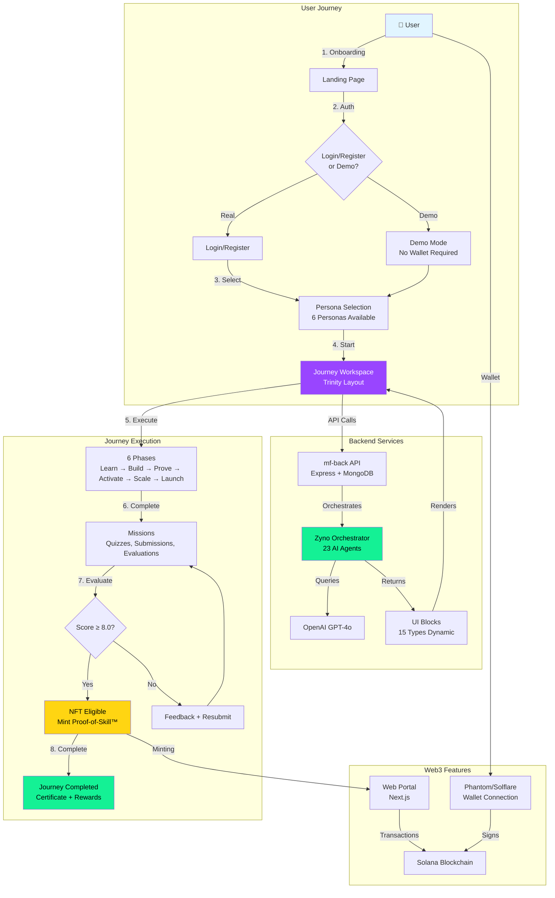

### 1.2 Monorepo Structure

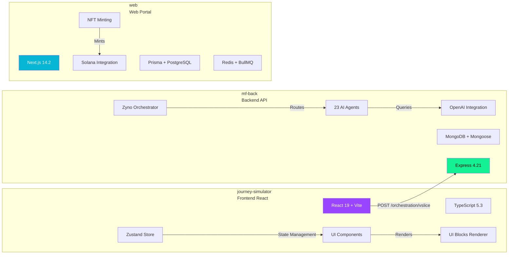

---

## 2. Workflows de Navigation

### 2.1 Navigation Principale - Sitemap

```mermaid
flowchart TD
    ROOT[/] --> HOME[Home Page<br/>Landing]
    HOME -->|Get Started| LOGIN[Login Page]
    HOME -->|Try Demo| DEMO[Demo Mode]

    LOGIN -->|Success| DASHBOARD[Dashboard]
    LOGIN -->|Register| REGISTER[Register Page]
    REGISTER --> DASHBOARD

    DEMO --> JOURNEYS_DEMO[/journeys/demo]
    DASHBOARD --> JOURNEYS[/journeys]

    JOURNEYS -->|No Persona Selected| PERSONAS[Personas Page<br/>6 Cards Grid]
    JOURNEYS -->|Persona Selected| WORKSPACE[Journey Workspace<br/>Trinity Layout]

    WORKSPACE -->|Complete All Phases| COMPLETED[Journey Completed Page]

    DASHBOARD --> PLAYGROUND[/playground]
    DASHBOARD --> RESOURCES[/resources]
    DASHBOARD --> SUPPORT[/support]
    DASHBOARD --> ZYNO_PAGE[/zyno]
    DASHBOARD --> GUIDE[/guide]
    DASHBOARD --> DAO[/dao]

    style HOME fill:#e1f5ff
    style WORKSPACE fill:#9945ff,color:#fff
    style COMPLETED fill:#14f195,color:#000
    style PERSONAS fill:#06b6d4,color:#fff
```

### 2.2 Workflow d'Onboarding Complet

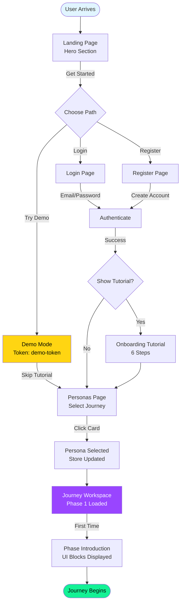

### 2.3 Navigation dans Journey Workspace

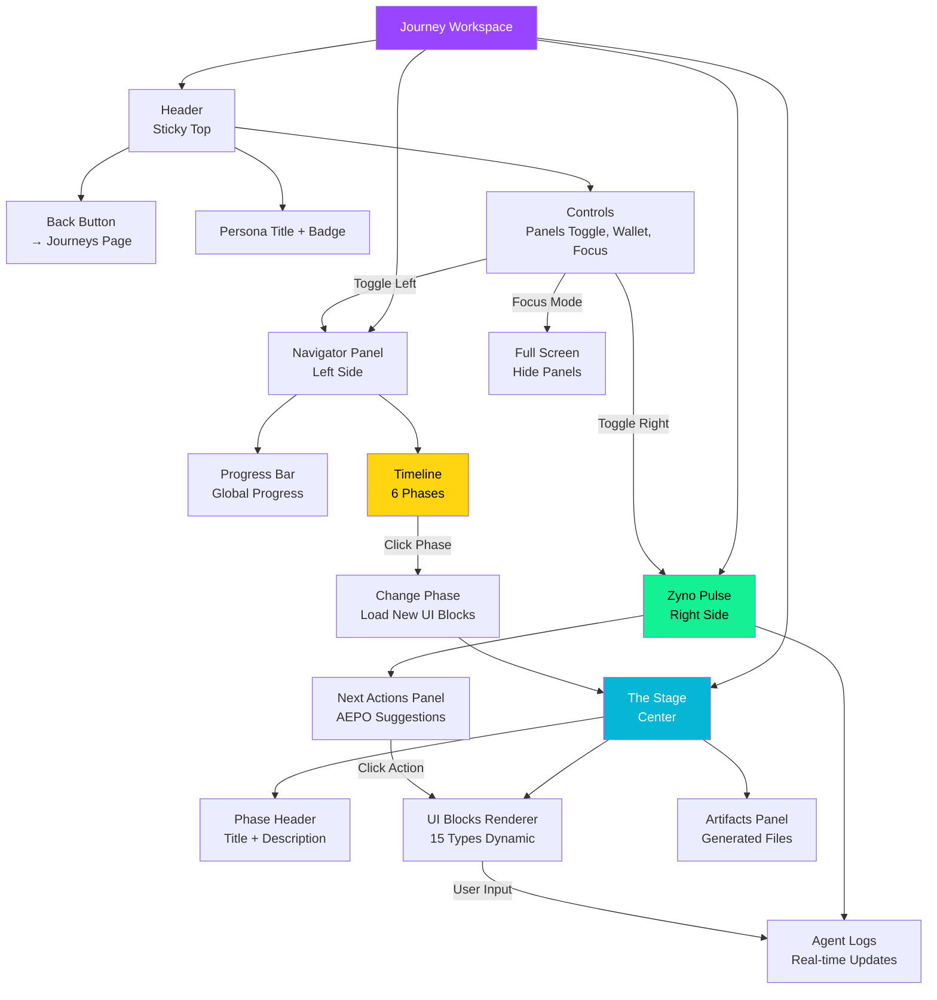

---

## 3. Logique Métier - Personas & Phases

### 3.1 Les 6 Personas

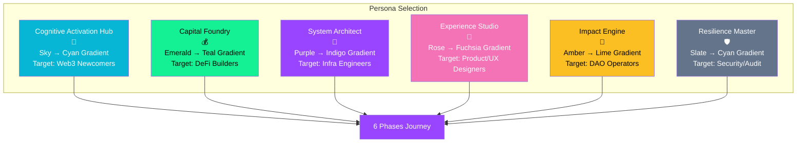

### 3.2 Structure des Phases

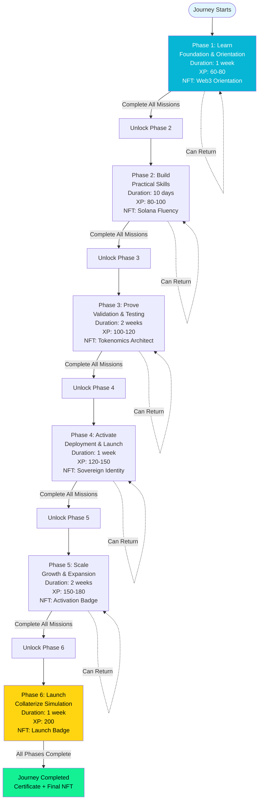

### 3.3 Progression et Verrouillage

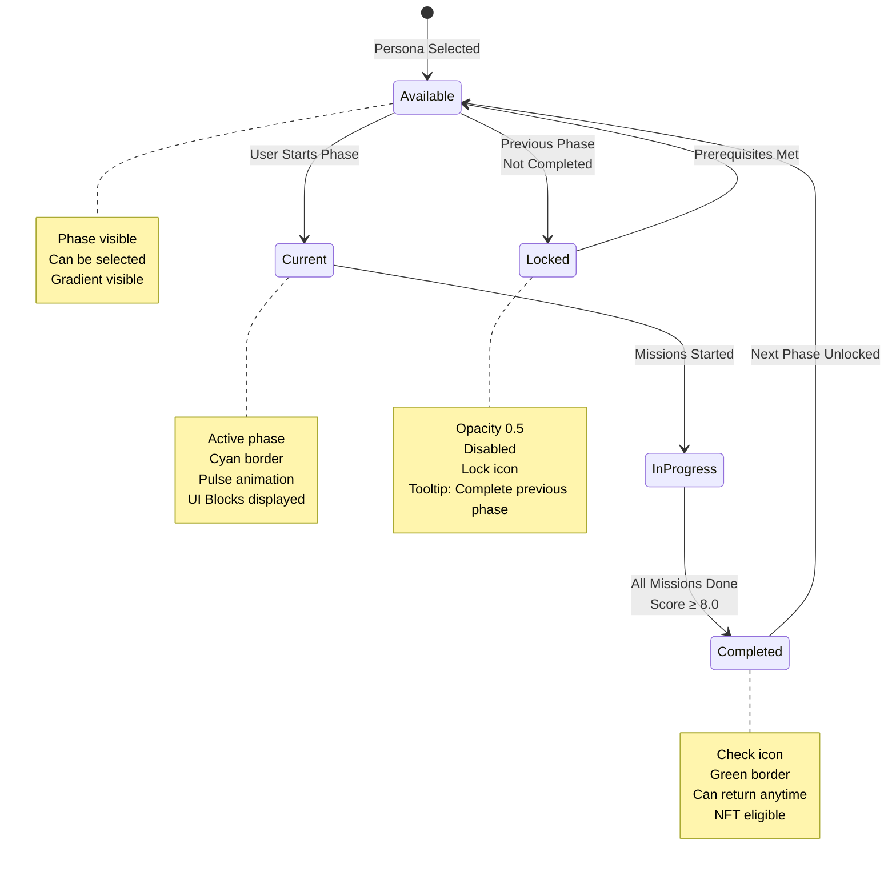

---

## 4. Logique Métier - Missions & Évaluations

### 4.1 Cycle de Mission Complet

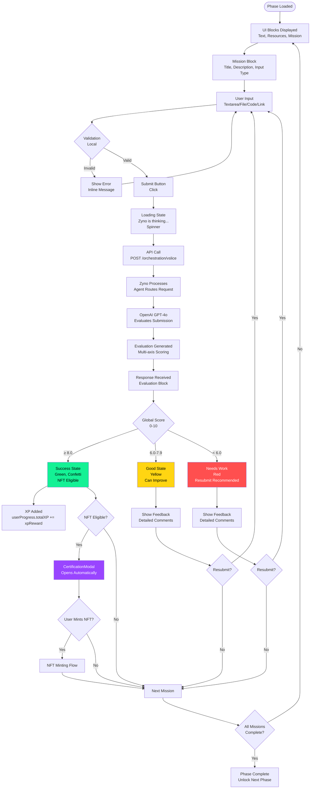

### 4.2 Système d'Évaluation Multi-Axes

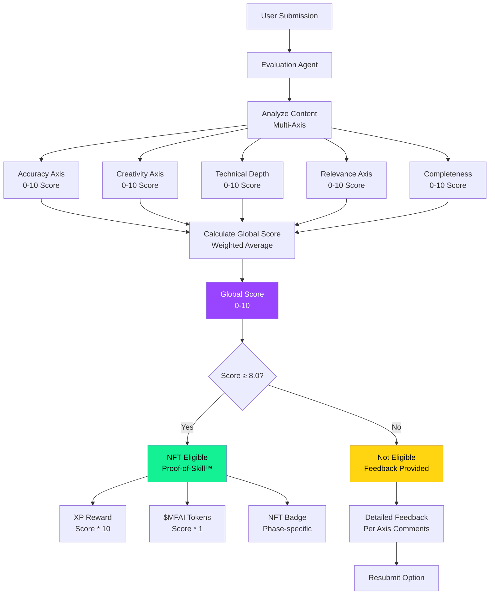

### 4.3 Types de Missions

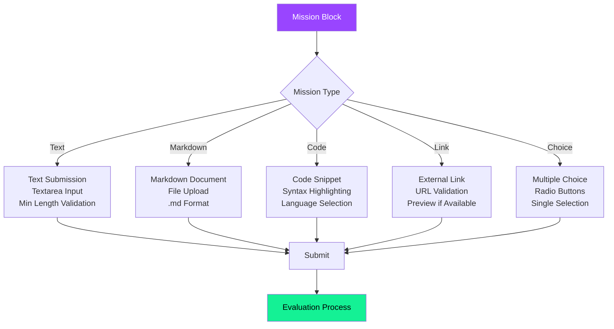

---

## 5. Structure des Composants UI

### 5.1 Hiérarchie Complète des Composants

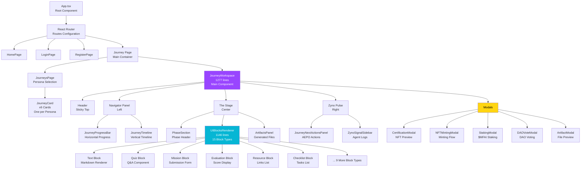

### 5.2 UI Blocks - Types et Rendu

```mermaid
graph LR
    RESPONSE[JourneyStepResponse<br/>from API] --> BLOCKS[ui_blocks Array<br/>UIBlock[]]

    BLOCKS --> RENDERER[UIBlocksRenderer<br/>Switch Statement]

    RENDERER -->|text_block| TEXT[Text Component<br/>Markdown → HTML]
    RENDERER -->|quiz_block| QUIZ[Quiz Component<br/>Q&A with Validation]
    RENDERER -->|mission_block| MISSION[Mission Component<br/>Submission Form]
    RENDERER -->|evaluation_block| EVAL[Evaluation Component<br/>Multi-axis Score]
    RENDERER -->|resource_block| RESOURCE[Resource Component<br/>Links + Icons]
    RENDERER -->|checklist_block| CHECKLIST[Checklist Component<br/>Tasks with Checkboxes]
    RENDERER -->|document_block| DOCUMENT[Document Component<br/>Full Markdown Doc]
    RENDERER -->|action_suggestions_block| ACTIONS[Actions Component<br/>Clickable Suggestions]
    RENDERER -->|xp_block| XP[XP Component<br/>Progress Display]
    RENDERER -->|diagram_block| DIAGRAM[Diagram Component<br/>Mermaid Renderer]
    RENDERER -->|dao_dashboard_block| DAO[DAO Component<br/>Governance Dashboard]
    RENDERER -->|project_selection_block| PROJECT[Project Component<br/>Selection Interface]
    RENDERER -->|narrative_choice_block| NARRATIVE[Narrative Component<br/>Story Choices]
    RENDERER -->|indicator_block| INDICATOR[Indicator Component<br/>Gauges/Charts]
    RENDERER -->|interactive_template_block| TEMPLATE[Template Component<br/>Forms/One-pagers]

    TEXT --> DISPLAY[Displayed in<br/>The Stage]
    QUIZ --> DISPLAY
    MISSION --> DISPLAY
    EVAL --> DISPLAY
    RESOURCE --> DISPLAY
    CHECKLIST --> DISPLAY
    DOCUMENT --> DISPLAY
    ACTIONS --> DISPLAY
    XP --> DISPLAY
    DIAGRAM --> DISPLAY
    DAO --> DISPLAY
    PROJECT --> DISPLAY
    NARRATIVE --> DISPLAY
    INDICATOR --> DISPLAY
    TEMPLATE --> DISPLAY

    style RENDERER fill:#9945ff,color:#fff
    style DISPLAY fill:#06b6d4,color:#fff
```

---

## 6. Flux de Données Utilisateur

### 6.1 State Management Flow

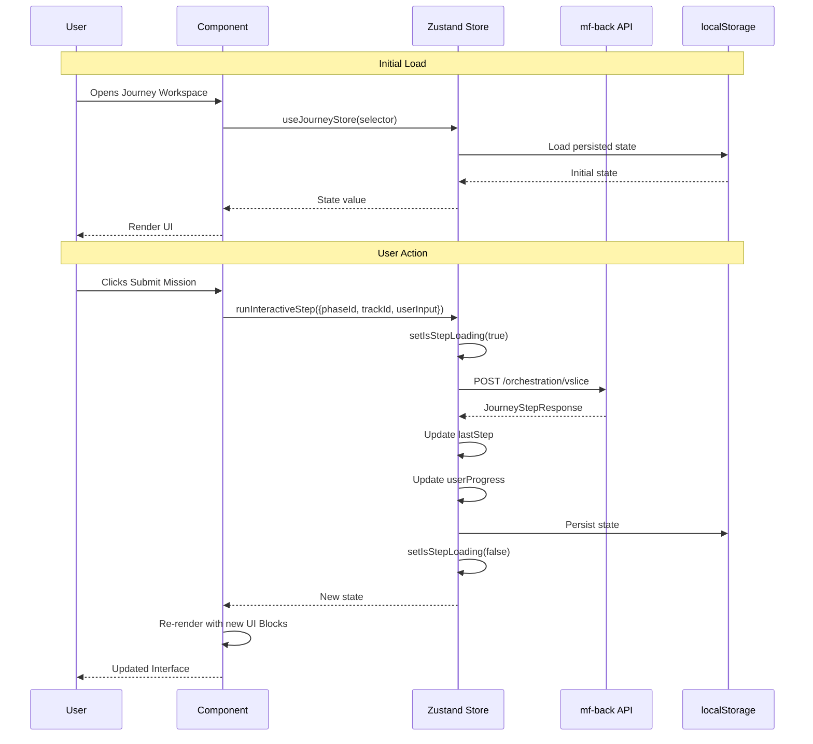

### 6.2 Data Flow - Complete Journey

```mermaid
flowchart TD
    USER[User Actions] --> COMPONENT[React Component]
    COMPONENT --> STORE[Zustand Store<br/>journeyStore.ts]

    STORE -->|Read| STATE[State<br/>selectedPersona<br/>currentPhase<br/>userProgress<br/>lastStep]
    STORE -->|Write| ACTIONS[Actions<br/>runInteractiveStep<br/>completePhase<br/>updateProgress]

    ACTIONS --> API[API Server<br/>mf-back]
    API --> ZYNO[Zyno Orchestrator]
    ZYNO --> AGENTS[AI Agents]
    AGENTS --> OPENAI[OpenAI GPT-4o]
    OPENAI --> AGENTS
    AGENTS --> ZYNO
    ZYNO --> RESPONSE[JourneyStepResponse<br/>ui_blocks[]]
    RESPONSE --> API
    API --> ACTIONS

    ACTIONS --> UPDATE[Update State]
    UPDATE --> STATE
    STATE --> PERSIST[Persist to<br/>localStorage]
    STATE --> RENDER[Re-render<br/>Components]
    RENDER --> USER

    style STORE fill:#9945ff,color:#fff
    style ZYNO fill:#14f195,color:#000
    style STATE fill:#06b6d4,color:#fff
```

---

## 7. États de l'Interface

### 7.1 États des Composants Principaux

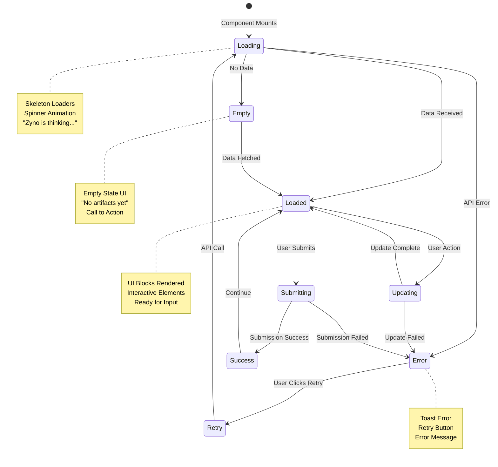

### 7.2 États de Phase

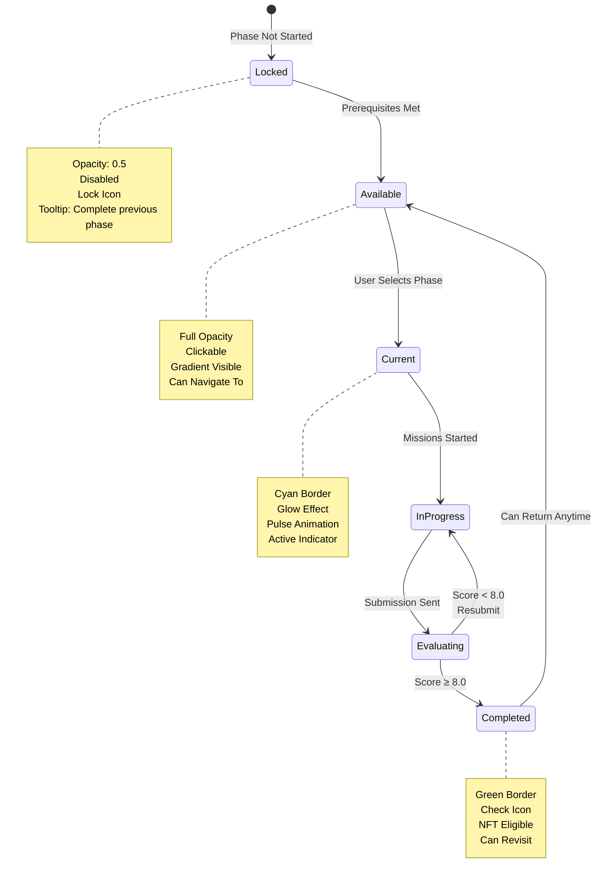

---

## 8. Interactions Utilisateur

### 8.1 Interactions dans Journey Workspace

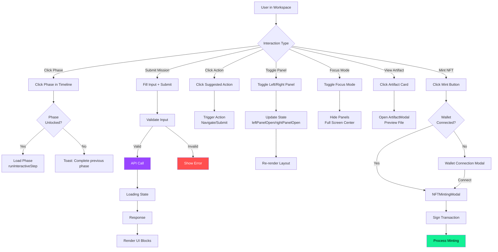

### 8.2 Interactions avec UI Blocks

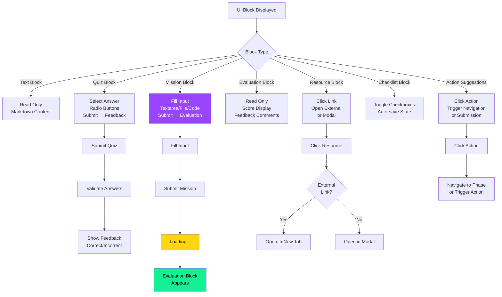

---

## 9. Système de Récompenses

### 9.1 XP et Tokens Flow

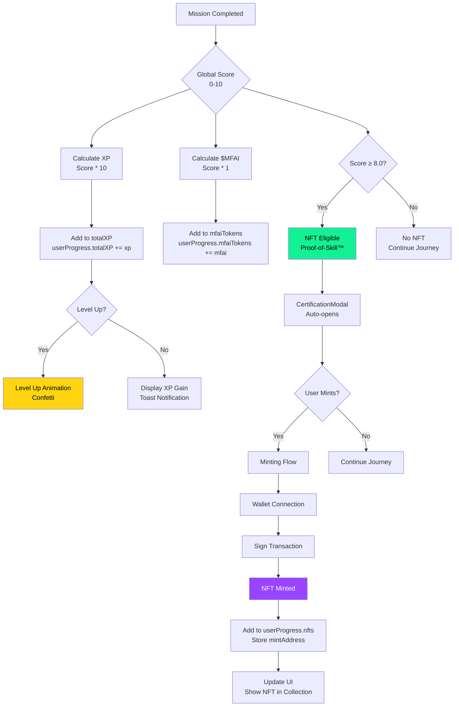

### 9.2 NFT Minting Flow Détaillé

```mermaid
sequenceDiagram
    participant U as User
    participant JS as Journey Simulator
    participant MODAL as CertificationModal
    participant MINT_MODAL as NFTMintingModal
    participant W as Wallet
    participant WEB as Web Portal
    participant S as Solana
    participant DB as Database

    U->>JS: Completes Mission<br/>Score ≥ 8.0
    JS->>MODAL: Auto-open CertificationModal
    MODAL->>U: Display NFT Preview<br/>Name, Image, Metadata
    U->>MODAL: Click "Mint NFT"
    MODAL->>MINT_MODAL: Open NFTMintingModal

    MINT_MODAL->>MINT_MODAL: Check Wallet Connection
    alt Wallet Not Connected
        MINT_MODAL->>W: Request Connection
        W->>U: Approve Connection
        W->>MINT_MODAL: Wallet Address
    end

    MINT_MODAL->>U: Display Preview<br/>NFT Metadata
    U->>MINT_MODAL: Confirm Mint
    MINT_MODAL->>WEB: Prepare NFT Transaction
    WEB->>WEB: Generate NFT Metadata
    WEB->>S: Create Transaction
    S->>W: Request Signature
    W->>U: Approve Transaction
    U->>W: Sign
    W->>S: Signed Transaction
    S->>S: Process Minting
    S->>WEB: Transaction Signature
    WEB->>DB: Store NFT Record
    DB->>WEB: Confirmed
    WEB->>MINT_MODAL: Success Response
    MINT_MODAL->>JS: Update userProgress.nfts
    JS->>U: Display Success<br/>Confetti + Explorer Link
```

---

## 10. Architecture UI - Trinity Layout

### 10.1 Layout Structure Détaillée

```mermaid
graph TB
    subgraph "JourneyWorkspace - Trinity Layout"
        subgraph "Header - Sticky z-50<br/>h-16, bg-[#0A0A1F]/95"
            H_LEFT[Back Button<br/>→ Journeys Page]
            H_CENTER[Persona Title<br/>+ Badge<br/>Gradient Persona]
            H_RIGHT[Controls<br/>Panels Toggle<br/>Wallet Status<br/>Focus Mode]
        end

        subgraph "Navigator - Left Panel<br/>w-64 or w-80<br/>Collapsible"
            N_PROGRESS[JourneyProgressBar<br/>Horizontal Bar<br/>6 Phases with Icons]
            N_TIMELINE[JourneyTimeline<br/>Vertical Timeline<br/>Clickable Phases<br/>States: Completed/Current/Locked]
        end

        subgraph "The Stage - Center<br/>max-w-[1200px]<br/>Main Content Area"
            S_HEADER[PhaseSection<br/>Phase Title<br/>Description<br/>Mission Overview]
            S_BLOCKS[UIBlocksRenderer<br/>Dynamic UI Blocks<br/>15 Types Supported<br/>Scrollable]
            S_ARTIFACTS[ArtifactsPanel<br/>Generated Artifacts<br/>Neural Overlay<br/>Preview Modal]
        end

        subgraph "Zyno Pulse - Right Panel<br/>w-80 or w-96<br/>Sticky lg:top-24<br/>Collapsible"
            Z_ACTIONS[JourneyNextActionsPanel<br/>AEPO Actions<br/>Clickable Suggestions<br/>Recent Agent Runs]
            Z_LOGS[ZynoSignalSidebar<br/>Agent Activity Logs<br/>Real-time Updates<br/>Scrollable]
        end
    end

    H_LEFT -->|Navigate| N_TIMELINE
    H_CENTER -->|Display| S_HEADER
    H_RIGHT -->|Toggle| N_PROGRESS
    H_RIGHT -->|Toggle| Z_ACTIONS
    H_RIGHT -->|Focus| FOCUS[Focus Mode<br/>Hide Panels<br/>Full Screen Center]

    N_TIMELINE -->|Phase Click| PHASE_CHANGE[Change Phase<br/>setCurrentPhase<br/>runInteractiveStep]
    PHASE_CHANGE --> S_BLOCKS

    S_BLOCKS -->|User Input| USER_ACTION[User Action<br/>Submit/Click]
    USER_ACTION --> API_CALL[API Call<br/>POST /orchestration/vslice]
    API_CALL --> Z_LOGS

    Z_ACTIONS -->|Action Click| TRIGGER[Trigger Action<br/>Navigate/Submit]
    TRIGGER --> S_BLOCKS

    S_ARTIFACTS -->|Artifact Click| ARTIFACT_MODAL[ArtifactModal<br/>Preview File<br/>Download/Share]

    style S_BLOCKS fill:#9945ff,color:#fff
    style Z_LOGS fill:#06b6d4,color:#fff
    style N_TIMELINE fill:#14f195,color:#000
    style H_CENTER fill:#ffd512,color:#000
```

### 10.2 Responsive Breakpoints

```mermaid
graph TB
    LAYOUT[Trinity Layout] --> DESKTOP{Screen Size}

    DESKTOP -->|≥ 1024px<br/>Desktop| DESKTOP_LAYOUT[Full Layout<br/>3 Panels Visible<br/>Navigator: w-64<br/>Stage: flexible<br/>Pulse: w-80]

    DESKTOP -->|768px - 1023px<br/>Tablet| TABLET_LAYOUT[Adapted Layout<br/>Navigator: Drawer<br/>Stage: Full Width<br/>Pulse: Bottom or Drawer]

    DESKTOP -->|< 768px<br/>Mobile| MOBILE_LAYOUT[Stacked Layout<br/>Navigator: Drawer<br/>Stage: Full Width<br/>Pulse: Drawer<br/>Panels Collapsible]

    DESKTOP_LAYOUT --> DESKTOP_FEATURES[All Features<br/>Sticky Panels<br/>Full Navigation<br/>Real-time Logs]

    TABLET_LAYOUT --> TABLET_FEATURES[Adapted Features<br/>Collapsible Panels<br/>Touch Gestures<br/>Optimized Spacing]

    MOBILE_LAYOUT --> MOBILE_FEATURES[Mobile Optimized<br/>Drawer Navigation<br/>Touch-friendly<br/>Reduced Padding]

    style DESKTOP_LAYOUT fill:#9945ff,color:#fff
    style TABLET_LAYOUT fill:#06b6d4,color:#fff
    style MOBILE_LAYOUT fill:#14f195,color:#000
```

---

## 📝 Notes pour le Spécialiste UI/UX

### Points Clés à Retenir

1. **Trinity Layout** : Architecture principale avec 3 zones (Navigator, Stage, Pulse)
2. **UI Blocks Dynamiques** : 15 types de blocks générés par l'IA
3. **State Management** : Zustand store centralisé avec persistence localStorage
4. **Workflow** : Onboarding → Persona Selection → 6 Phases → Completion
5. **Récompenses** : XP, $MFAI tokens, NFTs (Proof-of-Skill™)
6. **Évaluations** : Multi-axis scoring (0-10), NFT si score ≥ 8.0
7. **Responsive** : 3 breakpoints (Desktop, Tablet, Mobile)
8. **Web3** : Intégration Solana pour wallet et minting NFT

### Priorités de Refonte

1. **JourneyWorkspace** (Complexité 28) : Extraire en sous-composants
2. **UIBlocksRenderer** (Complexité 27) : Simplifier renderBasicMarkdown
3. **Accessibilité** : Remplacer `role="button"` par `<button>`
4. **Mobile** : Améliorer l'expérience tactile

---

## 👥 Contributeurs

**Équipe Money Factory AI** :

- **Kamel BEN RHOUMA** : Cofondateur et Full Stack Developer
- **Alaeddine BEN RHOUMA** : Cofondateur et Chief Operating & Blockchain Officer
- **Adem Behajaissa** : Backend Stack Developer

---

**Dernière mise à jour** : Décembre 2025
