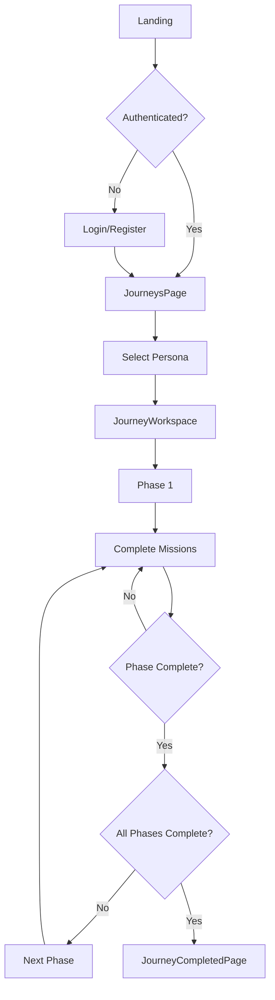
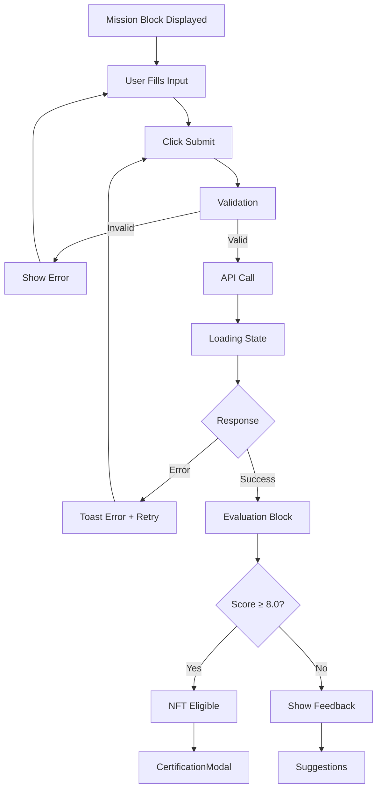

<!-- Production Ready - 2026 | Contributors: Alaeddine BEN RHOUMA, Kamel BEN RHOUMA, Adem BELHAJAISSA -->

<!-- Production Ready - 2026 | Contributors: Alaeddine BEN RHOUMA, Kamel BEN RHOUMA, Adem BELHAJAISSA -->

<!-- Production Ready - 2026 | Contributors: Alaeddine BEN RHOUMA, Kamel BEN RHOUMA, Adem BELHAJAISSA -->

# 🗺️ Flux Utilisateur Complets - Money Factory AI

*Documentation des parcours utilisateur pour spécialistes UI/UX*
*Version*: 1.0
*Dernière mise à jour*: Décembre 2025

---

## 📋 Table des Matières

1. [Flux d'Onboarding](#flux-donboarding)
2. [Flux de Sélection de Persona](#flux-de-sélection-de-persona)
3. [Flux d'Exécution de Journey](#flux-dexécution-de-journey)
4. [Flux de Mission](#flux-de-mission)
5. [Flux de Quiz](#flux-de-quiz)
6. [Flux d'Évaluation](#flux-dévaluation)
7. [Flux de Minting NFT](#flux-de-minting-nft)
8. [Flux de Staking](#flux-de-staking)
9. [Flux de Vote DAO](#flux-de-vote-dao)
10. [Flux de Visualisation d'Artefacts](#flux-de-visualisation-dartefacts)
11. [Flux de Completion](#flux-de-completion)
12. [Flux Demo Mode](#flux-demo-mode)

---

## 1. Flux d'Onboarding

### 1.1 Landing Page

**Fichier** : `journey-simulator/src/pages/HomePage.tsx`

**Écran** :

```
┌─────────────────────────────────────┐
│         HERO SECTION                │
│  - Titre principal                  │
│  - Description                      │
│  - CTA "Get Started"               │
│  - Wallet connection optionnelle   │
└─────────────────────────────────────┘
```

**Actions Utilisateur** :

1. Arrive sur `/`
2. Lit la présentation
3. Clique "Get Started" → Redirige vers `/login` ou `/register`

**États Visuels** :

- **Default** : Hero avec gradient background
- **Hover CTA** : Glow effect, scale légère
- **Wallet Connected** : Badge "Connected" visible

### 1.2 Login/Register

**Fichiers** :

- `journey-simulator/src/components/LoginPage.tsx`
- `journey-simulator/src/components/RegisterPage.tsx`

**Écran Login** :

```
┌─────────────────────────────────────┐
│         LOGIN FORM                  │
│  - Email input                      │
│  - Password input                   │
│  - "Login" button                   │
│  - "Demo Mode" link                 │
│  - "Register" link                 │
└─────────────────────────────────────┘
```

**Flux** :

```
1. User entre email/password
   ↓
2. Clique "Login"
   ↓
3. Loading state (spinner)
   ↓
4a. Success → Redirige vers /journeys
4b. Error → Toast error + retry
```

**Demo Mode** :

- Clique "Try Demo" → Token 'demo-token' stocké
- Redirige vers `/journeys/demo`
- Pas de wallet requis

### 1.3 Onboarding Tutorial (Optionnel)

**Fichier** : `journey-simulator/src/components/onboarding/OnboardingFlow.tsx`

**Étapes** :

1. Welcome
2. Persona Selection
3. Journey Phases
4. Zyno Assistant
5. Rewards System
6. Community

**UI** : Modal avec navigation next/prev, skip option

---

## 2. Flux de Sélection de Persona

### 2.1 JourneysPage

**Fichier** : `journey-simulator/src/components/JourneysPage.tsx`

**Écran** :

```
┌─────────────────────────────────────────────────┐
│              JOURNEYS GRID                     │
│  ┌─────────┐  ┌─────────┐  ┌─────────┐       │
│  │ Persona1│  │ Persona2│  │ Persona3│       │
│  │  Card   │  │  Card   │  │  Card   │       │
│  └─────────┘  └─────────┘  └─────────┘       │
│  ┌─────────┐  ┌─────────┐  ┌─────────┐       │
│  │ Persona4│  │ Persona5│  │ Persona6│       │
│  │  Card   │  │  Card   │  │  Card   │       │
│  └─────────┘  └─────────┘  └─────────┘       │
└─────────────────────────────────────────────────┘
```

**Layout** : Grid responsive

- Mobile : 1 colonne
- Tablet : 2 colonnes
- Desktop : 3 colonnes

**JourneyCard** :

- Gradient persona-specific
- Icône persona
- Titre et description
- Barre de progression (si déjà commencé)
- Badge statut (Available/Locked/Completed)

**Interactions** :

- **Hover** : Scale légère, glow effect, border accent
- **Click** : Redirige vers JourneyWorkspace avec persona sélectionnée

### 2.2 Sélection de Persona

**Flux** :

```
1. User clique sur JourneyCard
   ↓
2. Animation de transition
   ↓
3. Redirection vers /journeys/:personaId
   ↓
4. JourneyWorkspace s'affiche avec persona sélectionnée
   ↓
5. Phase 1 chargée automatiquement
```

**État dans le Store** :

```typescript
setSelectedPersona(persona);
// Met à jour : selectedPersona, currentPhase = 0
```

---

## 3. Flux d'Exécution de Journey

### 3.1 JourneyWorkspace Initial Load

**Fichier** : `journey-simulator/src/components/Journey/JourneyWorkspace.tsx`

**Flux** :

```
1. Component mount
   ↓
2. useEffect vérifie selectedPersona
   ↓
3. Si persona sélectionnée :
   - Charge la phase actuelle (currentPhaseIndex)
   - Appelle runInteractiveStep pour initialiser
   ↓
4. Affiche UI Blocks dans "The Stage"
```

**États** :

- **Loading** : Skeleton loaders
- **Loaded** : UI Blocks rendus
- **Error** : Toast error + retry button

### 3.2 Navigation entre Phases

**Flux** :

```
1. User clique sur une phase dans JourneyTimeline (left panel)
   ↓
2. setCurrentPhase(phaseIndex) appelé
   ↓
3. runInteractiveStep déclenché avec nouveau phaseId
   ↓
4. Nouveaux UI Blocks chargés
   ↓
5. Animation de transition
```

**Vérifications** :

- Phase locked ? → Toast "Complete previous phases first"
- Phase déjà complétée ? → Affiche résultats précédents
- Phase actuelle ? → Recharge les blocks

### 3.3 Auto-Simulation (Demo Mode)

**Fichier** : `journey-simulator/src/components/Journey/JourneyWorkspace.tsx` (lignes ~122-140)

**Flux** :

```
1. isDemo = true détecté
   ↓
2. useEffect déclenche auto-simulation
   ↓
3. Parcourt toutes les phases automatiquement
   ↓
4. Affiche progress indicator
   ↓
5. À la fin : Toast "Demo simulation complete"
```

**UI** :

- Progress bar avec "Phase X of Y"
- Abort button (autoSimAbortRef)
- Animation de progression

---

## 4. Flux de Mission

### 4.1 Affichage de Mission Block

**Composant** : `UIBlocksRenderer` → `<Mission />`

**Écran** :

```
┌─────────────────────────────────────┐
│      MISSION BLOCK                  │
│  - Titre                            │
│  - Description                      │
│  - Textarea (user input)            │
│  - XP Reward: 80 XP                 │
│  - NFT Reward: Proof-of-Skill™     │
│  - [Submit] button                  │
└─────────────────────────────────────┘
```

**États** :

- **Empty** : Textarea vide, button disabled
- **Filled** : Textarea avec contenu, button enabled
- **Submitting** : Loading spinner, button disabled
- **Submitted** : Success state, affichage du résultat

### 4.2 Soumission de Mission

**Flux** :

```
1. User remplit le textarea
   ↓
2. Clique "Submit"
   ↓
3. Validation locale (longueur min, format)
   ↓
4. runInteractiveStep appelé avec userInput
   ↓
5. Loading state :
   - Spinner dans le button
   - "Zyno is evaluating..." message
   ↓
6. Réponse reçue :
   - EvaluationBlock affiché avec score
   - XP ajouté si score ≥ 8.0
   - NFT eligibility si score ≥ 8.0
   ↓
7. Actions suggérées affichées
```

**Gestion d'Erreurs** :

- API error → Toast error + retry button
- Validation error → Message inline sous le textarea
- Timeout → Toast "Request timeout" + retry

### 4.3 Résultat d'Évaluation

**Composant** : `<Evaluation />` dans UIBlocksRenderer

**Affichage** :

- Score global (ex: 8.5/10) en grand
- Barres de progression pour chaque axe
- Commentaires détaillés
- Actions suggérées

**États Visuels** :

- **Score ≥ 8.0** : Green, confetti, "NFT Eligible" badge
- **Score 6.0-7.9** : Yellow, "Good, but can improve"
- **Score < 6.0** : Red, "Resubmit recommended"

---

## 5. Flux de Quiz

### 5.1 Affichage de Quiz Block

**Composant** : `<Quiz />` dans UIBlocksRenderer

**Écran** :

```
┌─────────────────────────────────────┐
│      QUIZ BLOCK                      │
│  Question 1: "What is...?"           │
│  ○ Option A                          │
│  ○ Option B                          │
│  ○ Option C                          │
│  ○ Option D                          │
│  [Submit Answer]                     │
└─────────────────────────────────────┘
```

**Interactions** :

- Radio buttons pour sélection
- Hover effect sur options
- Submit button (disabled jusqu'à sélection)

### 5.2 Soumission de Quiz

**Flux** :

```
1. User sélectionne une option
   ↓
2. Option highlightée (border accent)
   ↓
3. Clique "Submit Answer"
   ↓
4. Validation immédiate :
   - Correct ? → Green border, check icon, explanation
   - Incorrect ? → Red border, X icon, correct answer highlight
   ↓
5. Explanation affichée
   ↓
6. Next question (si plusieurs questions)
```

**États Visuels** :

- **Selected** : Border accent-cyan, background accent/10
- **Correct** : Border success, check icon, glow green
- **Incorrect** : Border danger, X icon, correct answer highlight

---

## 6. Flux d'Évaluation

### 6.1 Multi-Axis Evaluation

**Composant** : `<Evaluation />` dans UIBlocksRenderer

**Affichage** :

```
┌─────────────────────────────────────┐
│   EVALUATION RESULTS                 │
│                                      │
│   Global Score: 8.5/10              │
│   ┌─────────────────────────────┐   │
│   │ Accuracy:     ████████░░ 8.0│   │
│   │ Creativity:   █████████░ 9.0│   │
│   │ Technical:    ████████░░ 8.0│   │
│   └─────────────────────────────┘   │
│                                      │
│   Feedback: "Excellent work..."      │
│   [View Details] [Next Mission]      │
└─────────────────────────────────────┘
```

**Animations** :

- Barres de progression animées (0 → score)
- Confetti si score ≥ 8.0
- Toast success avec XP gagné

---

## 7. Flux de Minting NFT

### 7.1 Déclenchement

**Condition** : Score ≥ 8.0/10 sur une mission

**Flux** :

```
1. Mission évaluée avec score ≥ 8.0
   ↓
2. CertificationModal s'affiche automatiquement
   ↓
3. Affiche :
   - Preview NFT (image)
   - Titre et description
   - Métadonnées (phase, persona, date)
   ↓
4. Actions :
   - "Mint NFT" button
   - "Share" button
   - "Close" button
```

### 7.2 Processus de Minting

**Fichier** : `journey-simulator/src/components/NFTMintingModal.tsx`

**Flux** :

```
1. User clique "Mint NFT"
   ↓
2. NFTMintingModal s'ouvre
   ↓
3. Vérification wallet :
   - Si non connecté → Wallet connection modal
   - Si connecté → Continue
   ↓
4. Preview NFT metadata
   ↓
5. User confirme → Transaction signing
   ↓
6. Loading state :
   - "Signing transaction..."
   - Spinner
   ↓
7. Transaction soumise
   ↓
8. Attente confirmation (polling)
   ↓
9a. Success :
    - Confetti
    - Toast "NFT minted successfully"
    - Lien vers Solana Explorer
    - NFT ajouté à userProgress.nfts
9b. Error :
    - Toast error
    - Retry button
```

**États Visuels** :

- **Step 1 (Preview)** : NFT image, metadata, confirm button
- **Step 2 (Signing)** : Spinner, "Please sign in your wallet"
- **Step 3 (Processing)** : Progress indicator, "Minting..."
- **Step 4 (Success)** : Confetti, success message, explorer link
- **Step 4 (Error)** : Error message, retry button

---

## 8. Flux de Staking

### 8.1 Accès au Staking

**Trigger** : User clique "Stake $MFAI" (dans JourneyWorkspace ou dashboard)

**Fichier** : `journey-simulator/src/components/StakingModal.tsx`

### 8.2 Processus de Staking

**Flux** :

```
1. StakingModal s'ouvre
   ↓
2. Affichage :
   - Balance $MFAI disponible
   - Input amount
   - Preview voting power (amount * 2)
   ↓
3. User entre amount
   ↓
4. Validation :
   - Amount > 0
   - Amount ≤ balance
   ↓
5. Clique "Confirm Stake"
   ↓
6. Transaction signing (si wallet requis)
   ↓
7. Success :
   - Toast "Staked successfully"
   - userProgress.stakedMfai mis à jour
   - userProgress.votingPower mis à jour
```

**UI** :

- Input avec validation en temps réel
- Preview du voting power
- Balance visible
- Transaction status

---

## 9. Flux de Vote DAO

### 9.1 Affichage de Proposition

**Composant** : `<DAODashboard />` ou `DAO_DASHBOARD_BLOCK`

**Écran** :

```
┌─────────────────────────────────────┐
│   DAO PROPOSAL                       │
│   Title: "Proposal X"                │
│   Description: "..."                 │
│   Votes For: 45                      │
│   Votes Against: 12                  │
│   Status: Active                     │
│   [Vote] button                      │
└─────────────────────────────────────┘
```

### 9.2 Processus de Vote

**Fichier** : `journey-simulator/src/components/DAOVoteModal.tsx`

**Flux** :

```
1. User clique "Vote"
   ↓
2. DAOVoteModal s'ouvre
   ↓
3. Sélection :
   - Radio buttons : For / Against / Abstain
   ↓
4. Commentaire optionnel (textarea)
   ↓
5. Clique "Submit Vote"
   ↓
6. Validation :
   - Option sélectionnée
   - Voting power > 0
   ↓
7. Transaction signing
   ↓
8. Success :
   - Toast "Vote recorded"
   - Proposal mise à jour
   - userProgress.daoProposals++
```

**UI** :

- Radio buttons avec labels clairs
- Preview du voting power utilisé
- Commentaire optionnel
- Confirmation avant submit

---

## 10. Flux de Visualisation d'Artefacts

### 10.1 Liste d'Artefacts

**Fichier** : `journey-simulator/src/components/Journey/JourneyWorkspace.tsx` (lignes ~1070-1120)

**Écran** :

```
┌─────────────────────────────────────┐
│   ARTIFACTS PANEL                    │
│   ┌─────────┐  ┌─────────┐          │
│   │ Artifact│  │ Artifact│          │
│   │   Card  │  │   Card  │          │
│   └─────────┘  └─────────┘          │
└─────────────────────────────────────┘
```

**ArtifactCard** :

- Titre
- Agent owner
- Version
- Category
- Cliquable → Ouvre ArtifactModal

### 10.2 Visualisation d'Artefact

**Fichier** : `journey-simulator/src/components/Artifacts/ArtifactModal.tsx`

**Flux** :

```
1. User clique sur ArtifactCard
   ↓
2. ArtifactModal s'ouvre
   ↓
3. Affichage :
   - Titre et métadonnées
   - Preview (iframe si HTML, download si autre)
   ↓
4. Actions :
   - "Download" button
   - "Share" button
   - "Close" button
```

**Preview** :

- **HTML** : iframe avec `src={artifact.fileUrl}`
- **Markdown** : Rendu markdown
- **Autre** : Download button uniquement

---

## 11. Flux de Completion

### 11.1 Phase Completion

**Flux** :

```
1. User complète toutes les missions d'une phase
   ↓
2. Phase marquée comme "completed"
   ↓
3. Animation :
   - Confetti
   - Toast "Phase X completed!"
   - XP ajouté
   ↓
4. Phase suivante débloquée
   ↓
5. UI Blocks de la nouvelle phase chargés
```

### 11.2 Journey Completion

**Fichier** : `journey-simulator/src/components/JourneyCompletedPage.tsx`

**Flux** :

```
1. Toutes les phases complétées
   ↓
2. JourneyCompletedPage s'affiche
   ↓
3. Affichage :
   - Félicitations
   - Résumé (XP total, NFTs, etc.)
   - Certificat de completion
   ↓
4. Actions :
   - "Mint Completion NFT"
   - "Share Achievement"
   - "Start New Journey"
```

**Animations** :

- Confetti massif
- Fade-in du certificat
- Progress bars animées

---

## 12. Flux Demo Mode

### 12.1 Activation

**Flux** :

```
1. User clique "Try Demo" sur login
   ↓
2. Token 'demo-token' stocké dans localStorage
   ↓
3. Redirection vers /journeys/demo
   ↓
4. Mode demo activé (isDemo = true)
```

### 12.2 Comportement en Demo

**Différences** :

- Pas de wallet requis
- Pas de transactions réelles
- Données mockées (artefacts statiques)
- Auto-simulation activée par défaut

**UI Indicateurs** :

- Badge "DEMO" visible
- Toast "Demo mode active"
- Certaines fonctionnalités désactivées (staking réel, minting réel)

---

## 13. Diagrammes de Flux

### 13.1 Flux Principal (Simplifié)



### 13.2 Flux de Mission (Détaillé)



---

## 14. Points d'Attention UX

### 14.1 Feedback Immédiat

**Règle** : Toute action utilisateur doit avoir un feedback visuel immédiat (< 100ms)

**Implémentations** :

- Hover states sur tous les éléments interactifs
- Loading states pendant les appels API
- Success/Error toasts pour les actions importantes

### 14.2 Gestion des Erreurs

**Pattern** :

1. Toast error avec message clair
2. Action de retry si applicable
3. Message d'aide si nécessaire

**Exemples** :

- API error → "Failed to submit. Please try again." + Retry button
- Wallet error → "Transaction cancelled. Please try again."
- Validation error → Message inline sous le champ

### 14.3 États de Chargement

**Types** :

- **Skeleton** : Pour le contenu qui se charge
- **Spinner** : Pour les actions en cours
- **Progress Bar** : Pour les opérations longues (auto-sim)

**Règle** : Toujours afficher un état de chargement si > 200ms

### 14.4 Confirmations

**Quand demander confirmation** :

- Actions destructives (reset progress)
- Transactions blockchain (minting, staking, voting)
- Navigation away avec données non sauvegardées

**Pattern** :

```tsx
const handleAction = () => {
  if (confirm('Are you sure?')) {
    // Proceed
  }
};
```

---

## 15. Métriques UX à Surveiller

### 15.1 Performance

- **Time to First Contentful Paint (FCP)** : < 1.5s
- **Largest Contentful Paint (LCP)** : < 2.5s
- **Time to Interactive (TTI)** : < 3.5s

### 15.2 Engagement

- **Taux de completion de phase** : Objectif > 70%
- **Temps moyen par phase** : À mesurer
- **Taux de minting NFT** : Objectif > 50% des éligibles

### 15.3 Erreurs

- **Taux d'erreur API** : Objectif < 1%
- **Taux d'abandon de mission** : À mesurer
- **Taux d'erreur wallet** : Objectif < 5%

---

## 👥 Contributeurs

**Équipe Money Factory AI** :

- **Kamel BEN RHOUMA** : Cofondateur et Full Stack Developer
- **Alaeddine BEN RHOUMA** : Cofondateur et Chief Operating & Blockchain Officer
- **Adem Behajaissa** : Backend Stack Developer

---

**Dernière mise à jour** : Décembre 2025
**Version du document** : 1.0

*Ce document décrit tous les flux utilisateur de manière détaillée pour faciliter la refonte UI/UX.*
